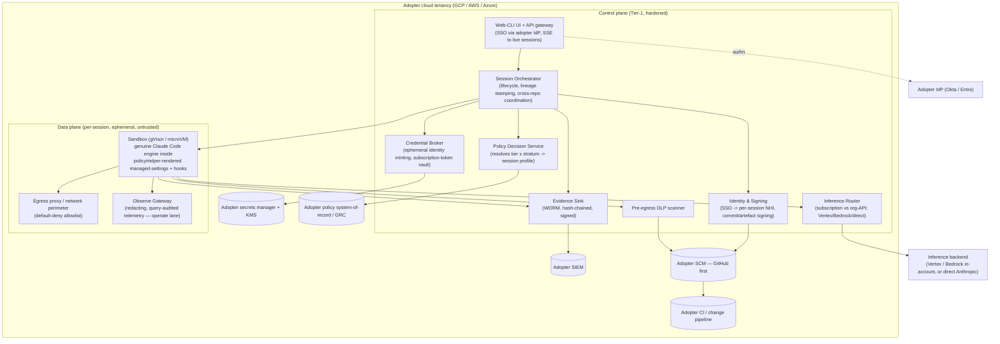

# Console7 — Architecture

This describes the logical architecture, the trust and data-flow boundaries, the
pluggable provider seams that make bring-your-own real, and the session lifecycle.
It is deliberately implementation-agnostic above the provider interfaces.

## 1. Architectural principles

- **Everything runs in the adopter's tenancy.** The only boundary crossing is model
  inference, to the adopter-chosen backend. (§3)
- **Control plane vs data plane are separated.** The control plane (UI, orchestrator,
  policy, broker, evidence) is small, hardened, and Tier-1. Sandboxes are the data
  plane — disposable, isolated, untrusted-by-default.
- **Pluggable seams everywhere.** Cloud, secrets, identity, SCM, inference, policy
  engine, policy system-of-record, and evidence sink are interfaces, not hard
  dependencies. (§5)
- **Ephemeral by default.** Sandboxes and the identities they carry are created per
  session and destroyed with it.

## 2. Logical components



**Component responsibilities (and boundaries):**

- **Web-CLI UI + API gateway** — authenticates the user against the adopter IdP,
  streams the live session, accepts launch requests. Thin; holds no secrets.
- **Session Orchestrator** — owns session lifecycle; calls the PDP for the profile;
  asks the Broker for identities; provisions the sandbox; **stamps lineage**
  (human → NHI → action) since the engine's sub-agent lineage is leaky; coordinates
  cross-repo sessions; emits events to Evidence.
- **Policy Decision Service (PDP)** — resolves the **target's** tier × stratum from
  the policy system-of-record into a **session profile** (egress allowlist,
  autonomy ceiling, persona constraints, human-gate flag); applies take-the-max +
  step-up across multiple targets; integrates the policy engine (OPA/Cedar). Does
  **not** own the system of record.
- **Credential Broker** — mints short-lived cloud/SCM identities (WIF/OIDC, GitHub
  App tokens) from the adopter's secrets manager; manages the per-user subscription
  vault; injects credentials into the sandbox at start. Stores **no** long-lived
  cloud/SCM secrets.
- **Identity & Signing** — binds the SSO subject to a per-session non-human
  identity; signs commits and artefacts (Sigstore-keyless / org CA).
- **Sandbox Runtime** — the gVisor/microVM isolate that runs the genuine Claude
  Code engine; `policyHelper` renders the composed, locked managed-settings for the
  session's persona × tier; PreToolUse hooks (incl. the operate tripwire) run here.
- **Egress proxy / network perimeter** — the **authoritative** default-deny egress
  wall (out-of-band), allowlisting the inference endpoint, registries, approved
  internal services, and approved MCP domains.
- **Observe Gateway** — operate-lane façade over production telemetry: redaction,
  query audit, rate limiting; the right to attach and redaction depth scale with
  tier.
- **Inference Router** — selects subscription vs org-API and the backend per
  enterprise policy; enforces the attended/unattended seam.
- **Pre-egress DLP** — secret/PII/classification scanning on commits and sends;
  blocking for high tiers.
- **Evidence Sink** — WORM, hash-chained, signed; streams to SIEM; system of record
  for verification, separate from the operational DB.

## 3. Trust & data-flow boundaries

The single most important diagram for a regulated adopter: **what stays in-tenant
vs what crosses the boundary.**

| Asset / flow | Location | Crosses to Anthropic? |
|---|---|---|
| Source code, repo contents | Adopter SCM + sandbox | No |
| Tool execution, filesystem, processes | Sandbox (adopter cloud) | No |
| Cloud & SCM credentials | Broker + secrets manager (adopter) | No |
| Subscription OAuth token | Per-user vault (adopter) | Used only to authenticate the user's own session |
| Production logs / telemetry | Observe Gateway (adopter) | No |
| Evidence, transcripts, audit | WORM + SIEM (adopter) | No |
| **Model prompts & responses** | — | **Yes — to the chosen backend** |

The model-inference crossing is the **only** one, and its destination is an adopter
choice: **Vertex or Bedrock keep inference inside the adopter's own cloud
account/region**; **direct Anthropic** leaves to the Anthropic API under commercial
terms. Console7 documents this boundary precisely so the adopter can self-classify
against their obligations; it does not make that determination for them.

## 4. Deployment topology

- **Reference runtime:** Kubernetes in the adopter's cloud; control-plane services
  as a small hardened namespace; sandboxes as gVisor-isolated pods or microVMs,
  short-lived, network-policied to the egress proxy only.
- **Reference cloud:** GCP (first). The cloud-specific pieces — sandbox isolation,
  egress perimeter (VPC firewall / NAT, with VPC Service Controls guarding the Google
  API surface only — see `providers/cloud-gcp/`), secrets/KMS, workload identity — sit
  behind the provider interfaces (§5) so AWS and Azure are parity targets, not
  rewrites.
- **Resilience is an adopter choice, exposed as configuration** (not a fixed
  feature): single-region, multi-region active-active, and an optional isolated
  break-glass instance are deployment options. Console7's requirement is to be
  *deployable* HA; the posture is the adopter's.

## 5. Provider interfaces (the bring-your-own seams)

Each is a stable interface with a default implementation; adopters select or
implement their own. This is what makes "bring your own everything" real and what
keeps the maintainer out of the adopter's tenancy.

| Interface | Selects / abstracts | Default ref |
|---|---|---|
| `CloudProvider` | sandbox isolation, networking, perimeter | GCP (gVisor + VPC firewall/NAT; VPC-SC guards Google APIs) |
| `SecretsProvider` | secret storage, envelope encryption, KMS | GCP Secret Manager + Cloud KMS |
| `IdentityProvider` | user SSO/OIDC, group/role mapping | OIDC (Okta / Entra) |
| `SCMProvider` | clone, branch, PR, short-lived tokens | GitHub App |
| `InferenceBackend` | subscription / Vertex / Bedrock / direct | Vertex |
| `PolicyEngine` | rule evaluation | OPA (or Cedar) |
| `PolicySoR` | authoritative tier × stratum lookup | pluggable adapter |
| `EvidenceSink` | WORM store + SIEM stream | GCS bucket-lock + SIEM webhook |
| `ObserveGateway` | redacting, audited telemetry reads | pluggable adapter |

## 6. Repository layout & release artifacts

Console7 is a **monorepo, not a monolith**. The two decisions are separate and have
different answers.

### 6.1 Repository: monorepo core + standalone SDK + out-of-tree ecosystem

One repository for the core, for reasons sharper here than for a typical project:
the provider interfaces are the contract surface, and the conformance suite tests
the *composed* system — changing `SecretsProvider` changes the interface, the
reference implementation, and the conformance test in **one atomic PR**, not a
version-skew dance across repos (especially while the boundaries are still soft).
It is also a security control plane an enterprise **audits as one unit**, with one
signed release, one SBOM, one provenance trail.

Two carve-outs keep it from sprawling:

- **The interface contracts and extensibility SDK are published as an independently
  versioned, standalone package** — the canonical, system-of-record SDK is a **Go
  module** (`docs/adr/0001-language.md`) — even though it is *developed* in the
  monorepo. Any npm / PyPI / crate artifacts are **generated or hand-maintained
  bindings** over that Go module, not independent reimplementations. The SDK's
  stability is the promise to adopters and connector authors; nobody should fork the
  repo to write a provider.
- **Community and third-party provider implementations live out-of-tree**, in their
  own repos, against the published SDK — the Terraform-core-plus-providers /
  out-of-tree-CSI pattern. Core ships only a **reference** provider set. This keeps
  the long tail of connectors out of core's release cadence and blast radius, and
  keeps the maintainer from owning their security posture. The boundary is
  structural: **core + a stable SDK + an ecosystem.**

### 6.2 Runtime: modular monolith control plane, threat-model-driven splits

The sandboxes are separate isolation domains by design and the egress proxy is a
separate network element, so a single-process deployable is off the table. For the
rest, ship the **control plane as a modular monolith** initially — few moving parts
is a feature for something an enterprise self-hosts and must operate, patch, and
assure. Resist premature microservice decomposition; more services is more attack
surface and more to get wrong.

The one principled exception is driven by the threat model, not by fashion:
**peel the credential broker and signing service out early** into a minimal,
separately-hardened, narrowly-scoped service. Console7 holds everyone's keys;
control-plane-as-target is the headline abuse case (`DESIGN.md` §10.1), and isolating the
key-handling component limits what a control-plane compromise actually reaches.

### 6.3 Repository layout

```text
console7/
  README.md  GOAL.md  LICENSE  SECURITY.md  CONTRIBUTING.md
  docs/                 design, architecture, roadmap, threat model
  sdk/                  PUBLISHED, independently versioned (the promise)
    interfaces/         provider contracts (CloudProvider, SecretsProvider, …)
    testkit/            conformance harness adopters & authors run
  control-plane/        modular monolith — Tier-1 artifact, holds no keys at rest
    ui/                 web-CLI front + API gateway
    orchestrator/       lifecycle, lineage stamping, cross-repo coordination
    pdp/                policy decision service (tier × stratum → profile)
    inference-router/   subscription vs org-API; backend selection
    dlp/                pre-egress scanner
    evidence/           WORM writer + SIEM stream
  keybroker/            SEPARATELY HARDENED — distinct artifact
    broker/             ephemeral identity minting; per-user subscription vault
    signing/            SSO → NHI binding; commit/artefact signing
  sandbox/              data-plane — distinct base-image artifact (runs untrusted code)
    base-image/         wraps the genuine Claude Code engine + tooling
    egress-proxy/       default-deny perimeter helper
    observe-gateway/    operate-lane redacting, audited telemetry façade
  providers/            IN-TREE reference implementations ONLY
    cloud-gcp/  secrets-gcp/  scm-github/  inference-vertex/  policy-opa/  evidence-gcs/
  deploy/               reference Kubernetes / Helm / Terraform
  conformance/          control-objective mapping + CI-gated suite
```

Community providers (e.g. `cloud-aws`, `secrets-vault`, `scm-gitlab`) live in their
own repositories against `sdk/interfaces` — not under `providers/`, which carries
only the reference set.

### 6.4 Release artifacts

Distinct trust tiers ship as distinct, separately-signed artifacts. **The thing
that holds the keys must not share a build identity with the thing that runs
untrusted code.**

| Artifact | Trust tier | Holds / runs | Supply chain |
|---|---|---|---|
| Control-plane image(s) | Tier-1, pristine | orchestration, PDP, evidence; **no keys at rest** | signed · SBOM · provenance |
| Key-broker / signing image | Tier-1, highest isolation | key minting, subscription vault, signing | signed · SBOM · provenance · separately scoped |
| Sandbox base image | runs untrusted agent code | the engine + tools | signed · SBOM · provenance · **distinct build identity** |
| SDK packages | public contract | interfaces + conformance testkit | semver · signed · published to registries |

## 7. Session lifecycle

```mermaid
sequenceDiagram
  participant U as User (browser)
  participant UI as Web-CLI UI
  participant O as Orchestrator
  participant P as PDP
  participant B as Credential Broker
  participant S as Sandbox (Claude Code)
  participant X as Egress proxy
  participant E as Evidence (WORM)

  U->>UI: authenticate (adopter IdP / SSO)
  U->>UI: launch session (persona, target repo)
  UI->>O: request
  O->>P: resolve target tier x stratum -> profile
  P-->>O: profile (egress allowlist, ceiling, human-gate?)
  O->>B: mint ephemeral identities (cloud/SCM); inject subscription token if attended
  B-->>O: short-lived creds (die with session)
  O->>S: provision sandbox (gVisor; policyHelper renders managed-settings; allowlist set)
  O->>E: session-start event (human -> NHI lineage)
  loop agentic loop
    S->>X: tool call (egress default-deny; managed rules + tripwire in-sandbox)
    X-->>S: allowed / denied (denials -> incident)
    S->>E: tool-call evidence (stamped, signed)
  end
  S->>S: produce change -> DLP scan -> signed commit -> PR (never direct prod mutation)
  O->>E: session-end event (chain sealed)
  O->>S: destroy sandbox (ephemeral)
```

Key invariants enforced across the lifecycle: profile derives from the **target**
(not the launcher); egress is **default-deny at the boundary**; mutation of
production is **impossible from the session** (read-only identity + tripwire +
propose-via-PR); lineage is **stamped at the orchestrator**; evidence is
**append-only and signed**.

## 8. Engine relationship to Claude Code

Console7 orchestrates the **genuine** engine; it does not fork the agent. Two paths:

- **Attended / subscription:** the CLI signed into the user's own seat (interactive
  OAuth), for that user's own work only.
- **Org-API / automation:** the Agent SDK / CLI with an org API key via the chosen
  backend (the Agent SDK does not accept subscription OAuth).

The upstream version is **pinned**; upgrades are **canaried** before fleet rollout
(an upstream change can shift permission/hook behaviour). `policyHelper` is the hook
by which Console7 injects the composed, locked managed-settings per session.

## 9. Build-vs-adopt note

Anthropic's **Managed Agents — self-hosted sandboxes** are adjacent prior art: they
keep **orchestration on Anthropic's side** while **tool execution, filesystem, and
egress run in the adopter's infrastructure**, with model I/O flowing to Anthropic's
control plane. That boundary satisfies many residency requirements out of the box,
and Console7 adopters with a looser orchestration-residency bar should evaluate it
before building. **Console7's distinguishing choice is that the orchestration and
control plane also run in the adopter's tenancy** — the right call when in-tenant
orchestration is itself a requirement (assurance-of-control, data residency, or
avoiding a hard external dependency for a mandatory path).
