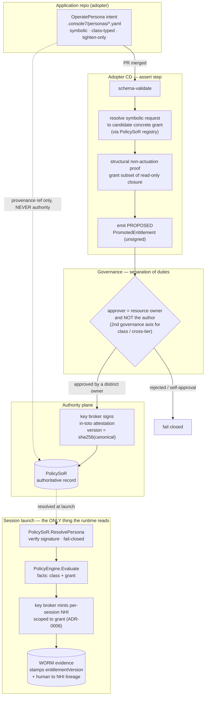

# 5. Entitlement sourcing and the persona-as-code promotion contract

- **Status:** Draft (proposed — under review)
- **Date:** 2026-06-27
- **Deciders:** Console7 maintainers
- **Supersedes / Superseded by:** —

> ADRs capture a single, significant, hard-to-reverse choice and the reasoning behind it
> (see `docs/adr/0001-language.md`). This one is a **DRAFT for review**; it is not yet Accepted.
> Pairs with [ADR-0006](0006-hi-nhi-identity-and-wielder-intersection.md) (the HI/NHI identity model
> the resolved entitlements are minted into).

## Context

An operate-lane (or any non-author) session runs an agent under a **persona**. The persona's
**entitlements** — what cloud/telemetry/SCM scope the agent's per-session identity may hold — must come
from somewhere. Adopters told us they want three sourcing models, **chosen per persona**, none a
prerequisite:

1. **App-expressed (persona-as-code).** The application's *own* repo declares its operational personas;
   the adopter's CD asserts them into deployment. The modern path.
2. **Operator-team-configured.** The cloud/SRE/governance team wires fine-grained permissions to the
   persona directly.
3. **Human-grounded (SSO).** The persona runs grounded in the wielding human's own identity/entitlements
   — as-is (dangerous) or downscoped.

The hard constraint is **tenet 3**: *"scope follows the artefact, resolved from the policy
system-of-record (AUTHORITATIVE), never from an in-repo file (intent only)."* And **tenet 1**: Console7
must not become the owner/authority of the adopter's policy. Today the `PolicySoR` seam is **read-only**
(`ResolveRepo`/`ResolveResource → TierStratum`); there is **no path to ingest a promoted persona /
entitlement set**, and no persona-resolution method. That gap is what this ADR fills.

The naive reading of source (1) — "Console7 reads `app/operations.yaml` at launch and grants it" —
**directly violates tenet 3** and is a privilege-escalation foot-gun (a malicious PR to the file
self-grants). So the central design question is: **how does Console7 consume app-declared personas
without ever trusting the file as authority?**

## Decision

**Hybrid. Engineer a minimal *intent* spec; adopt the *promotion* mechanics; let the adopter own the
authority.** Console7 is a **promotion conduit into the adopter's policy authority, never its owner.**

### 1. A minimal `OperatePersona` intent spec (engineered, Console7-native)

App devs commit a tiny declarative record (e.g. `.console7/personas/*.yaml`), shaped for IDP/Backstage
catalog pickup on the *binding* fields but Console7-native on the entitlement payload. It is an
entitlement **request**, NOT a policy language (we do not ask app devs to write Rego/Cedar). Four
properties make it **intent, not authority, by construction**:

- **Symbolic, not concrete.** It names *what* (`telemetry, read, service: payments-api`), **never** an
  IAM role, ARN, project, or scope. The concrete grant is *manufactured at promotion* against the
  PolicySoR resource registry. A forged file **cannot name a privileged role because the vocabulary has
  no role names** (the SPIRE "selectors, not self-asserted identity" lesson).
- **Closed, monotone `class` enum** (`observe` ⇒ structurally non-actuating; `propose`; never `actuate`).
  The schema rejects any mutate verb under a non-actuating class. The dev cannot define a stronger class.
- **Tighten-only constraints.** Constraints (TTL, data-class denies, regions) compose by **intersection**
  with platform/tier floors. A malicious edit can only *shrink* reach.
- **Never read at launch.** Console7 has **no code path that fetches the app-repo file when a session
  starts** — tenet 3 enforced architecturally, not by lint. Only the promoted artifact (below) reaches
  the runtime.

### 2. The promotion contract — how intent becomes authority (adopted from in-toto/SLSA + OPA-bundle GitOps)

- The adopter's **CD** validates the spec, resolves the symbolic request to a *candidate concrete grant*
  against the PolicySoR, runs the **structural non-actuation proof** (§4), and emits a *proposed*
  `PromotedEntitlement`.
- **Separation of duties (configurable, default-on):** approval is by the **target resource's owner**
  (resolved from PolicySoR ownership), and **MUST be distinct from the source-repo author**. Where the
  app team owns its own prod (you-build-it-you-run-it), a **second governance axis** is required for
  `class` boundaries and any cross-tier reach. Self-approval is a **hard seam failure**, not a warning.
  Reuse the adopter's JIT/approval engine (Teleport / ConductorOne / Entitle) or a CODEOWNERS-gated
  policy store.
- **Promotion = a signed, content-addressed attestation.** The **key broker** (distinct signing identity)
  signs an in-toto-style attestation whose predicate is the canonical `PromotedEntitlement` and whose
  subject digest is `entitlementVersion = sha256(canonical(...))`. It lands in the **PolicySoR** as the
  authoritative record. The source-repo commit is referenced for *provenance*, never as authority.

### 3. Consumption at session launch (small seam delta)

- New read method: **`PolicySoR.ResolvePersona(service, persona) → (PromotedEntitlement, version, error)`**,
  fail-closed (unknown persona ⇒ most-restrictive/deny, mirroring `ResolveRepo`).
- The resolved grant + persona class feed **`PolicyEngine.Evaluate`** as *facts* (engine stays
  data-only / fail-closed — unchanged contract).
- The **key broker / `IdentityProvider`** mints the per-session NHI scoped to the resolved grant
  (see [ADR-0006](0006-hi-nhi-identity-and-wielder-intersection.md)).
- The orchestrator **stamps `entitlementVersion` + the promotion signature ref into the WORM evidence**
  at session start, alongside human→NHI lineage — so an auditor resolves the hash back to the promoted
  object, its approver, and the source commit.

### 4. "observe = non-actuating", VERIFIED not assumed (three layers; the boundary is authoritative)

1. **Promotion-time structural proof** — the concrete grant set MUST be a subset of a statically-defined,
   conservative **read-only capability closure** per `CloudProvider` (deny-unknown-verb). Promotion
   **fails closed** if non-actuation is not provable.
2. **Runtime PolicyEngine obligation** — `class: observe` carries no actuate obligation; any mutate denies.
3. **The minted NHI simply LACKS write permissions** — the control of record (tenet 2). Even a buggy
   upper layer cannot actuate.

The guarantee is the **intersection of (1) and (3)**; (2) is in-band defence-in-depth.

### Source unification

`ResolvePersona` abstracts the source. **(1) app-expressed** = promoted via this contract; **(2)
operator-configured** = written directly into the PolicySoR (no app-repo step); **(3) human-grounded** =
resolved at launch from the wielder's identity, then downscoped (ADR-0006). One authoritative resolution,
three back-ends.

## Visualised flow

## Decision drivers

- **Tenet 3** — the file is intent; authority is the promoted, governance-gated record. Enforced by the
  runtime never reading the repo file.
- **Tenet 1** — Console7 is a conduit into the adopter's authority, not the policy owner.
- **Tenet 5 / least privilege** — the symbolic vocabulary caps blast radius; non-actuation is *proved*.
- **Don't reimplement** — adopt in-toto/SLSA signing + OPA-bundle promotion + existing JIT/SoD tooling;
  engineer only the small intent spec the industry has no exact donor for.

## Consequences

- **New `PolicySoR.ResolvePersona` read method** + **new write-side promotion port** (PolicySoR is
  read-only today; the asymmetry — resolvable but not owned-by-Console7 — is itself a stated principle).
- **New signed artifact type `PromotedEntitlement`** (content-addressed in-toto attestation, a new
  release-artifact class alongside the policy bundle).
- **The read-only capability closure is a dedicated, tracked risk** — cloud-specific, non-trivial ("read"
  APIs with side effects exist), needs a conservative deny-unknown-verb allowlist with its own security
  review. It is the piece that *earns* the observe≠actuate claim and the riskiest novel work.
- **Adoption friction (open):** two policy stores (app repo intent + SRE-owned promoted store). The
  GitOps-reconciler reference keeps it ergonomic; validate with a design partner.
- **SoD is configurable** (you-build-it-you-run-it orgs differ); the second-governance-axis is the default
  for class/cross-tier boundaries, not a hardcoded universal rule.

## Open questions (to resolve before Accepted)

- The exact `OperatePersona` schema fields + the `class` enum closed set.
- The promotion port reference impl: GitOps reconciler into an SRE-owned store vs. API submission to an
  adopter GRC — ship both? which first?
- The read-only capability closure format + how it's authored/reviewed per `CloudProvider`.

## Links

- Pairs with [ADR-0006 — HI/NHI identity model & wielder-intersection](0006-hi-nhi-identity-and-wielder-intersection.md).
- `GOAL.md` tenets 1, 3, 5; `docs/ARCHITECTURE.md` §5 (seams), §4.2 (cross-repo take-the-max).
- Prior art: in-toto/SLSA signed attestations; OPA bundle build/sign/promote (Styra DAS); SPIFFE/SPIRE
  registration (selectors vs self-assertion); Backstage `catalog-info` (binding/ownership only — its
  "file is authoritative" semantics are deliberately NOT inherited); AWS Cedar / OPA Rego as
  `PolicyEngine` backings; Teleport/ConductorOne/Entitle for the SoD/approval seam.
