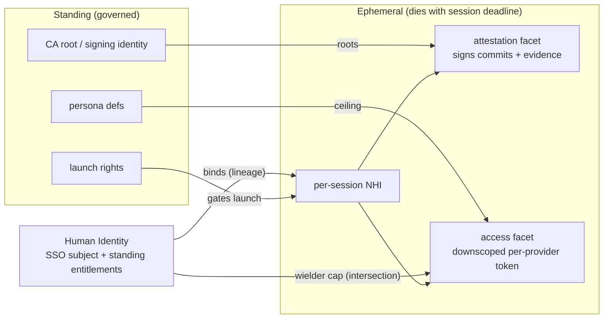

# 6. Human & Non-Human Identity model, and the wielder-intersection

- **Status:** Draft (proposed — under review)
- **Date:** 2026-06-27
- **Deciders:** Console7 maintainers
- **Supersedes / Superseded by:** —

> ADRs capture a single, significant, hard-to-reverse choice (see `docs/adr/0001-language.md`). This one
> is a **DRAFT for review**; it is not yet Accepted. It is the foundational identity model that
> [ADR-0005](0005-entitlement-sourcing-and-persona-as-code-promotion.md) (entitlement sourcing) mints
> into. **Getting this wrong is a re-foundation, not a refactor** — hence the deliberate ADR before the
> operate-lane build.

## Context

Every Console7 session runs an agent under a **per-session Non-Human Identity (NHI)** bound to the
**Human Identity (HI)** that launched it, with lineage human → NHI → action signed by the key broker.
The product's guarantees (evidence, observe≠actuate, least-privilege) all rest on this binding.

Three things make the current model insufficient for Phase 2/3 and expensive to retrofit later:

1. **The NHI today is logical-only.** It is an *attestation* identity (`nhi/<session>/<persona>`,
   KMS-rooted, signs commits + evidence) — but it carries **no downscoped *access* credential**. The
   agent's actual cloud/SCM reach is not yet derived from, or bounded by, the NHI.
2. **The HI binding is stubbed.** Production authn is a dev assertion under a process-local key (SAST
   #9/#10, banner-flagged); there is no real OIDC IdP, and `PolicySoR` is `FixedPolicySoR`.
3. **The wielder principle is unimplemented.** We want: *an agent can never do something its launching
   human couldn't.* That requires the NHI's access to be the **intersection** of the persona ceiling, the
   target app's ownership, and **the human's own standing entitlements** — a real mechanism, not a
   docstring.

The conflation to avoid: **the NHI is two coherent-but-different things.** An *attestation identity*
(who signed this) and an *access identity* (what credential touched production). We have the first; this
ADR designs the second and welds them.

## Decision

### A. The four-stage trust chain, with the key broker as the single authz/mint chokepoint

1. **Authenticate the HI** via `IdentityProvider` (real OIDC/SSO) → verified subject + group claims +
   the human's standing entitlements (resolvable from the adopter's IdP/IAM).
2. **Check launch rights** — a **distinct authorization** from the persona's entitlements: *may this HI
   launch this persona, in this env, for this app?* Resolved from the PolicySoR (itself sourced as-code,
   per ADR-0005). Launch-rights ≠ entitlements: holding the right to launch a persona is separate from
   what that persona then grants.
3. **Resolve the entitlement set** (ADR-0005) and compute the **effective NHI scope =
   `persona ceiling ∩ target-app ownership ∩ wielder's standing entitlements`** (see §B).
4. **Mint the NHI** at the key broker (the *only* authz/mint point; it holds the signing identity) —
   ephemeral, TTL ≤ session deadline — and project it into each backend at the effective scope.

### B. The wielder-intersection mechanism — credential downscoping (the crux, hard to reverse)

`NHI access ⊆ the human's own standing access` is enforced **mechanically by per-provider credential
attenuation**, not by policy text:

- **GCP** — short-lived token via SA impersonation **with a downscoped credential / IAM Condition**
  bounding to the resolved grant (Credential Access Boundaries).
- **AWS** — STS `AssumeRole` with a **session policy** that is the intersection.
- **GitHub** — installation-token **permission narrowing** to the resolved repo/scope.

The `IdentityProvider` (and `CloudProvider`/`SCMProvider`) seams **must expose attenuation** so the minted
principal is the *intersection*, never a fixed role, and MUST do so **faithfully or fail** (Hardening
H3 — no silent round-up). **Decided default: strict subset (attenuation), non-configurable** — the agent
can never exceed the wielder. A **persona-defined / break-glass** mode (the agent runs broader than the
human's day-to-day, on the *right to launch* alone) is an **explicit, governance-gated, evidenced
exception** that **does not ship in the first cut** (Hardening H7).

### C. Two welded NHI facets

| Facet | Purpose | State | Root |
|---|---|---|---|
| **Attestation identity** | signs commits + stamps evidence (who acted) | exists | KMS-rooted CA (key broker) |
| **Access identity** | the downscoped per-provider credential (what touched prod) | **new** | minted from §B at the effective scope |

Both bind to the **same NHI id and the same lineage record**, so every *access* is provably tied to the
*attested* human → NHI chain. Neither facet outlives the session.

### D. Standing vs. ephemeral boundary (tenet 4)

- **Standing** (durable, governed): persona definitions, launch rights, the CA root / signing identity,
  the IdP trust config.
- **Ephemeral** (per session, dies with the deadline): the NHI, both its facets, and every minted token.

No standing production-write credential exists anywhere (tenet 5). The key broker holds the only standing
signing identity; access credentials are always minted fresh and bounded.

### E. Evidence binding

Session-start evidence stamps **HI + the launch-rights decision + the resolved entitlementVersion
(ADR-0005) + persona + NHI id**, so an auditor reconstructs *which human, under which launch authority,
with which policy version, via which NHI, performed which action.*

## Visualised — the trust chain

```mermaid
sequenceDiagram
    actor Human as Human (wielder)
    participant IdP as IdentityProvider (SSO/OIDC)
    participant Orch as Orchestrator
    participant SoR as PolicySoR (authoritative)
    participant KB as Key broker (mint + sign)
    participant Prov as Cloud / SCM provider
    participant EV as WORM evidence

    Human->>IdP: authenticate (SSO)
    IdP-->>Orch: HI assertion (subject, groups, standing entitlements)
    Orch->>SoR: launch-rights? (HI x persona x env x app)
    SoR-->>Orch: allow / DENY (fail-closed)
    Orch->>SoR: ResolvePersona -> PromotedEntitlement (ADR-0005)
    SoR-->>Orch: grant + version (signed)
    Note over Orch: effective scope =<br/>persona ceiling INTERSECT app ownership INTERSECT wielder entitlements
    Orch->>KB: mint NHI (effective scope, TTL <= deadline)
    KB-->>Orch: NHI {attestation facet (KMS-signed)}
    KB->>Prov: attenuate credential (downscoped token / session policy / narrowed install token)
    Prov-->>KB: NHI {access facet (downscoped)}
    Orch->>EV: stamp HI + launch decision + entitlementVersion + persona + NHI
    Note over Prov,EV: agent acts within the access facet; every action attributed to the attested NHI
```

## Identity model at a glance



## Decision drivers

- **Tenet 6 (lineage unbroken) / evidence** — welding attestation + access to one NHI id keeps every
  action attributable.
- **Tenet 5 (observe≠actuate) / least privilege** — the wielder-intersection cap + per-session minting
  prevent an agent exceeding its human or holding standing write.
- **Tenet 4 (ephemeral)** — the standing/ephemeral line.
- **Hard-to-reverse** — the downscoping primitive and the keybroker-chokepoint are load-bearing across
  every provider; choosing them deliberately now avoids a re-foundation.

## Consequences

- **`IdentityProvider` (and `CloudProvider`/`SCMProvider`) seams must expose credential *attenuation*** —
  not just "mint a token for role X" but "mint a token for the *intersection* of a grant and the wielder's
  access." This shapes the seam signatures; getting it absent now is the expensive retrofit.
- **A new access-identity facet** on the NHI, minted per-provider; the keybroker grows from "signs" to
  "signs + mints downscoped access" (still the single chokepoint, still no standing write).
- **Real OIDC IdP** is on the critical path (closes SAST #9/#10) — the dev-assertion stub must go before
  this is real.
- **Break-glass mode** needs explicit guardrails — now decided in Hardening H7: it **does not ship in
  the first cut** (strict-subset only).

## Hardening requirements (MUST hold in implementation — resolved before Accepted)

The wielder-intersection is only a real guarantee if the **mint is deterministic and the cloud
provably enforces exactly the computed scope**. These are normative; each carries a conformance
obligation. (Paired with [ADR-0005](0005-entitlement-sourcing-and-persona-as-code-promotion.md)
Hardening, which covers the *promotion* side.)

**H1 — The mint is a pure function over a pinned, signed `ResolvedScope` record.** No live lookups at
mint time. At session start the orchestrator resolves all inputs *at one instant* and freezes them:

```
ResolvedScope {                      // signed; the ONLY input the broker mints from
  personaVersion         // content digest of the PromotedEntitlement (ADR-0005)
  wielderSnapshotDigest  // digest of the human's EFFECTIVE entitlements at T0 (not just group claims)
  ownershipDigest        // digest of the app-ownership record at T0 (ADR-0005 H5)
  codeRevision           // the git SHA the session will actually run (ADR-0005 H6)
  computedScope          // = Intersect(persona ceiling, app ownership, wielder standing) via ADR-0005 H1
}
```

Same record ⇒ same token, reproducibly. An auditor recomputes `Intersect(...)` from the pinned inputs
and asserts it equals `computedScope`. This is what makes "deterministic minting" a checkable property
rather than a description.

**H2 — Wielder resolution fails CLOSED.** If the human's effective entitlements cannot be resolved, the
mint is **denied** — it MUST NOT fall back to the persona ceiling (that silently deletes the wielder
cap, the §B guarantee). The snapshot is the *effective* IAM/entitlement set, not merely group claims.

**H3 — Attenuation is faithful or it fails.** The seam returns what the provider can *actually* enforce,
and the broker checks it:

```
AttenuateCredential(scope) → (credential, renderedScope, error)
// broker MUST assert renderedScope ⊆ computedScope, else FAIL CLOSED — never issue an over-broad token.
```

Where a primitive cannot express the bound (e.g. a GCP Credential Access Boundary that only constrains
Cloud Storage and not the API the scope names; an AWS session policy that cannot represent the
intersection), the mint **refuses**. The deterministic decision is never silently rounded *up* to what
the cloud finds convenient. (This is the "hardest-to-reverse" call below, now decided in favour of
faithful-or-fail.)

**H4 — The broker verifies; it never trusts the orchestrator's claimed scope.** At mint the broker
independently checks: the `ResolvedScope` signature; the launch-rights decision; that
`computedScope == recompute(Intersect)`; and not-revoked (ADR-0005 H7). A compromised orchestrator
(Tier-1 but distinct from the broker) therefore cannot obtain an over-scoped mint — which is the only
thing that makes "single authz/mint chokepoint" true rather than aspirational.

**H5 — Split the access-minting key from the evidence/attestation-signing key.** Two distinct identities
within the broker: one mints access tokens, one signs evidence. A compromise of *minting* then cannot
also forge the *evidence* that would expose it — evidence stops being self-attesting.

**H6 — The minted principal carries the NHI id into the provider-native identity.** Attenuation MUST
embed the NHI id into the token's native field (AWS STS `RoleSessionName`, GCP token subject/label,
GitHub App context). Conformance asserts the **provider's own audit log** entry contains the NHI id —
so lineage is unbroken at the cloud boundary where forensics actually occur, not just inside Console7's
evidence.

**H7 — Strict-subset only in the first cut; break-glass does not ship yet.** `agent access ⊆ wielder`
is the *non-configurable* default. "Run broader than the human" is the inversion of the whole model and
its rules are unspecified — it is therefore **out of the first implementation**. If it is ever added it
requires: its own promotion class, mandatory dual approval, a hard short TTL, a real-time alert +
first-class evidence event per use, and per-adopter opt-in (default unavailable). You can add a governed
exception later; you cannot un-ship a leaky default.

**H8 — Cross-repo / multi-app composition is strict take-the-max-restrictive.** A session spanning
tiers takes the **intersection** (most-restrictive) of per-target scopes under a single NHI lineage —
never the union. Union-for-convenience would re-introduce cross-tier escalation (THREAT-MODEL §3)
through the persona path.

### Fail-closed defaults (encode literally)

| Condition | Result |
|---|---|
| Wielder entitlements unresolvable | **deny** (never fall back to persona ceiling) — H2 |
| Provider cannot render scope faithfully | **deny** — H3 |
| `ResolvedScope` signature invalid / scope ≠ recompute | **deny** — H4 |
| Entitlement revoked or superseded | **deny** — ADR-0005 H7 |
| Code revision ≠ promoted revision (sensitive persona) | **step-up or deny** — ADR-0005 H6 |

### Conformance obligations (land as stubs before implementation)

- `resolvedscope_test`: mint is a pure function of the signed record; auditor recompute equals
  `computedScope` (H1); wielder-unresolvable ⇒ deny (H2).
- `attenuation_faithfulness_test` (per provider): mint for scope S, then actively call a representative
  *out-of-scope* API and assert the **cloud** denies it; unrenderable scope ⇒ mint refused (H3).
- `broker_verify_test`: orchestrator-claimed over-scope refused; signature/recompute/revocation checks (H4).
- `lineage_provider_log_test`: provider-native audit entry carries the NHI id (H6).

## Open questions (genuinely undecided — adopter-shaped, not security-load-bearing)

- **Launch-rights representation** — distinct as-code artifact vs. facet of the persona promotion
  (ADR-0005). (Either is safe under H4; note that folding it into the persona promotion means the
  persona author influences *who may launch* — so if folded, it inherits ADR-0005 H4/H5 SoD.)
- The exact `wielderSnapshot` shape per `IdentityProvider` — what "effective entitlements" serialises to
  for GCP/AWS/GitHub (the *faithful-or-fail* contract in H3 is decided; this is the encoding detail).

## Links

- Pairs with [ADR-0005 — entitlement sourcing & persona-as-code promotion](0005-entitlement-sourcing-and-persona-as-code-promotion.md).
- `GOAL.md` tenets 4, 5, 6; `docs/ARCHITECTURE.md` §2 (lineage), §5 (seams); `docs/THREAT-MODEL.md`.
- Related: SAST #9/#10 (self-attested `--user`/`--attended`, the dev-IdP residual this closes); the key
  broker (`keybroker/`); the `IdentityProvider` seam (`sdk/interfaces/identity.go`).
- Prior art: OIDC Workload Identity Federation; GCP Credential Access Boundaries / downscoped tokens; AWS
  STS session policies; GitHub App installation-token scoping; SPIFFE/SPIRE (attestation vs. self-assertion).
