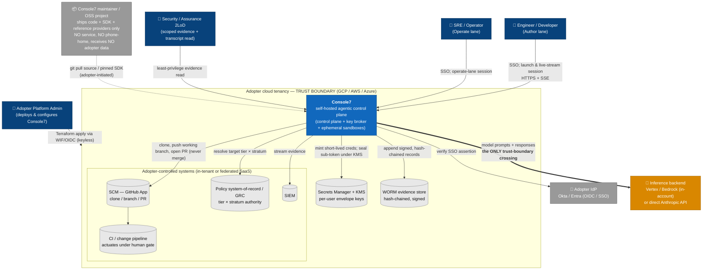

# 01 — System Context (C4 Level 1)

**Audience:** executives, security leadership, regulated-enterprise adopters evaluating
Console7, first-time readers.
**Question answered:** *What is Console7, who and what does it talk to, and where is the
trust boundary?* In particular — what stays inside the adopter and what (if anything)
leaves it.

Console7 is an open-source, **self-hosted** control plane that lets enterprise staff run
genuine Claude Code agents inside the adopter's *own* cloud tenancy, under enterprise
policy. The defining property of the whole system is visible at this level: **the
maintainer hosts nothing and receives nothing; the only flow that crosses the adopter's
trust boundary is model inference**, to a backend the adopter chooses
(`GOAL.md` tenet 1; `docs/ARCHITECTURE.md` §3).

## How to read it

- **People.** Two *first-party* user roles map to the two product personas
  (`docs/DESIGN.md` §1.2): **Author** (develop → PR) and **Operate** (read-only
  production telemetry → propose). A **2LoD assurance** reader gets least-privilege,
  logged evidence access (`DESIGN.md` §6); the **Platform Admin** stands the system up
  with Terraform and keyless federation, never with stored keys.
- **The maintainer is outside everything and supplies only software.** There is no
  maintainer-operated runtime in the picture — the dashed line is adopter-initiated
  source/SDK pull. This is tenet 1 made literal and is the precondition for open-source
  trust in a security control plane.
- **The trust boundary is the adopter's tenancy.** Console7, its secrets/KMS, its
  evidence store, and the adopter's SCM/GRC/SIEM/pipeline all sit inside it. (GitHub and
  the IdP may be federated SaaS in practice; they are *adopter-controlled* either way —
  Console7 treats the authoritative perimeter as the egress allowlist and network zone,
  not a vendor's cloud identity, per `docs/adr/0004`.)
- **One bold crossing.** Only `model prompts + responses` leave the boundary, and only
  to the **adopter-chosen** backend. **Vertex/Bedrock keep inference inside the adopter's
  own cloud account**; **direct Anthropic** leaves to the Anthropic API under commercial
  terms. Console7 *names* this boundary so the adopter can self-classify; it does not make
  the regulatory determination for them (`GOAL.md` non-goals; `DESIGN.md` §9).

## Notes & confidence

- The IdP is drawn **outside** the tenancy (federated identity) and SCM **inside the
  adopter-controlled band**, following `docs/ARCHITECTURE.md` §2. Both are pluggable seams
  (`IdentityProvider`, `SCMProvider`); the reference set is Okta/Entra OIDC and GitHub App.
- The **CI/change pipeline** and the **human approval gate** are the adopter's; Console7
  *integrates*, it does not own the SDLC pipeline or the GRC system of record
  (`GOAL.md` non-goals). Actuation against production never happens from a session — see
  view [04](04-runtime-behaviour.md) and [06](06-data-flow-trust-boundaries.md).
- "Bedrock" and "AWS/Azure" appear as adopter choices the architecture explicitly admits
  (`ARCHITECTURE.md` §4, ADR-0004) but are **(assumed/planned)** — only the GCP + Vertex +
  direct-Anthropic reference paths exist in code today (see view [08](08-dependency-supply-chain.md)).
