# 02 — Functional / Logical Architecture (C4 Level 2: Containers)

**Audience:** engineers and architects building or reviewing Console7; adopters writing
their own provider implementations.
**Question answered:** *What are the deployable/logical building blocks, what is each one
responsible for, how do they call each other (sync vs async), and which trust tier does
each belong to?*

Console7 is a **monorepo, but not a monolith**. At runtime it is a **modular-monolith
control plane** plus two deliberately separated isolation domains: the **key broker**
(peeled out early so a control-plane compromise does not reach the keys) and the
**per-session sandbox** (which runs untrusted agent code). Everything composes against the
nine `sdk/interfaces` **provider seams**; reference implementations live in `providers/`.

Legend: ✅ implemented · ◻ scaffold/placeholder · ⬡ pluggable seam. **Faded + dashed = target state** (not yet coded & landed); solid = implemented & landed.

```mermaid
flowchart TB
  Browser["🌐 Browser (user)"]

  subgraph TEN["Adopter cloud tenancy"]
    direction TB

    %% ---------- Control plane (Tier-1, holds no keys at rest) ----------
    subgraph CP["Control plane &mdash; Tier-1 modular monolith (no keys at rest)"]
      direction TB
      UI["✅ ui &mdash; thin c7 CLI<br/>launch/watch/review one session<br/>SSO + SSE browser gateway ◻"]
      ORCH["✅ orchestrator<br/>session lifecycle; <b>stamps lineage</b><br/>human&rarr;NHI&rarr;action; cross-repo coord"]
      PDP["✅ pdp<br/>tier&times;stratum &rarr; SessionProfile<br/>take-the-max + step-up (◻ P3)"]
      IR["◻ inference-router<br/>subscription vs org-API selection<br/>(logic lives in broker + backends)"]
      DLP["◻ dlp<br/>pre-egress secret/PII scan<br/>blocks T1/T2"]
      EV["✅ evidence<br/>WORM Sink: hash-chain + signed<br/>checkpoints + verify; SIEM stream"]
    end

    %% ---------- Key broker (Tier-1, SEPARATE artifact) ----------
    subgraph KB["key broker &mdash; Tier-1, separately hardened, DISTINCT signing identity"]
      direction TB
      BRK["✅ broker<br/>mint per-session NHI; subscription + org-cred<br/>inject pass-through; sign session; route inference"]
      SIGN["✅ signing<br/>SSO&rarr;NHI bind; pluggable CA root<br/>(dev Ed25519 / prod KMS EC-P256)<br/>commit/record/checkpoint signatures"]
    end

    %% ---------- SDK seams ----------
    subgraph SDK["sdk/interfaces &mdash; the bring-your-own contract surface (9 seams)"]
      direction LR
      S1["⬡ CloudProvider"]
      S2["⬡ SecretsProvider"]
      S3["⬡ IdentityProvider"]
      S4["⬡ SCMProvider"]
      S5["⬡ InferenceBackend"]
      S6["⬡ PolicyEngine"]
      S7["⬡ PolicySoR"]
      S8["⬡ EvidenceSink"]
      S9["⬡ ObserveGateway"]
    end

    %% ---------- Data plane (untrusted, ephemeral) ----------
    subgraph DP["Data plane &mdash; per-session, ephemeral, UNTRUSTED (distinct base image)"]
      direction TB
      SB["✅ sandbox base-image<br/>wraps genuine Claude Code engine<br/>policyHelper: locked settings + tripwire hook"]
      PX["✅ egress proxy &mdash; per-session Squid<br/>default-deny FQDN perimeter (authoritative)<br/>rendered by cloud-gcp"]
      OG["◻ observe-gateway<br/>redacting, audited telemetry façade"]
    end

    %% ---------- Reference providers + adopter infra ----------
    subgraph PROV["providers/ &mdash; reference implementations only"]
      direction LR
      PCloud["✅ cloud-gcp<br/>gVisor + VPC"]
      PSec["✅ secrets-gcp<br/>KMS + Secret Manager"]
      PScm["✅ scm-github<br/>GitHub App"]
      PVx["✅ inference-vertex"]
      PAnt["✅ inference-anthropic"]
      POpa["◻ policy-opa"]
      PGcs["✅ evidence-gcs<br/>bucket-lock WORM"]
    end

    SECMGR[("Secrets Manager + KMS")]
    GCS[("GCS evidence bucket")]
    SANDINFRA[("GKE / gVisor + VPC firewall/NAT")]
  end

  IdP["Adopter IdP (OIDC)"]
  SoRsys[("Policy SoR / GRC")]
  GH[("GitHub")]
  INF["Inference backend (Vertex / Anthropic)"]
  SIEMsys[("SIEM")]

  %% ---------- Sync (solid) links ----------
  Browser -. "HTTPS + SSE (async stream)" .-> UI
  UI -->|"launch (sync)"| ORCH
  ORCH -->|"ResolveProfile (sync)"| PDP
  PDP --> S7
  ORCH -->|"mint NHI, sign, route, PR (sync)"| BRK
  BRK --- SIGN
  ORCH -->|"provision / egress / destroy"| S1
  ORCH -->|"append records"| S8
  ORCH -. "provision sandbox" .-> SB

  BRK --> S2
  BRK --> S3
  BRK --> S4
  BRK --> S5
  EV --> S8

  %% ---------- seam -> provider bindings ----------
  S1 -.-> PCloud
  S2 -.-> PSec
  S3 -.-> IdP
  S4 -.-> PScm
  S5 -.-> PVx
  S5 -.-> PAnt
  S6 -.-> POpa
  S7 -.-> SoRsys
  S8 -.-> PGcs
  S9 -.-> OG

  %% ---------- providers -> external/infra ----------
  PSec --> SECMGR
  PScm --> GH
  PVx ==> INF
  PAnt ==> INF
  PGcs --> GCS
  PCloud --> SANDINFRA
  EV -. "stream (async)" .-> SIEMsys

  %% ---------- data plane egress ----------
  SB --> PX
  PX ==>|"allowlisted only"| INF
  SB --> OG

  classDef tier1 fill:#cfe3f7,stroke:#1168bd,color:#11304a;
  classDef tier1Plan fill:#eef3f8,stroke:#9bb3cf,color:#8a97a6,stroke-dasharray:5 4;
  classDef broker fill:#e7d6f5,stroke:#7b3fab,color:#3a1d52;
  classDef dp fill:#f7d6d6,stroke:#c0392b,color:#5b1b14;
  classDef dpPlan fill:#fbeeee,stroke:#e2a7a1,color:#b08a86,stroke-dasharray:5 4;
  classDef seam fill:#d8f0dd,stroke:#27ae60,color:#13502a;
  classDef prov fill:#fff3cd,stroke:#b8860b,color:#5c4500;
  classDef provPlan fill:#fbf6e6,stroke:#ddc99c,color:#a89a78,stroke-dasharray:5 4;
  classDef store fill:#ececec,stroke:#888,color:#111;
  %% faded + dashed = target state (not yet coded & landed); solid = implemented & landed
  class ORCH,PDP,EV tier1;
  class UI,IR,DLP tier1Plan;
  class BRK,SIGN broker;
  class SB,PX dp;
  class OG dpPlan;
  class S1,S2,S3,S4,S5,S6,S7,S8,S9 seam;
  class PCloud,PSec,PScm,PVx,PAnt,PGcs prov;
  class POpa provPlan;
  class SECMGR,GCS,SANDINFRA,SoRsys,GH,SIEMsys store;
```

## Containers & responsibilities

### Control plane (Tier-1, `control-plane/`) — holds no keys at rest
| Container | Status | Responsibility |
|---|---|---|
| `ui` | ✅ `cli.go` + `cmd/c7` (thin CLI) | The thin `c7 launch` client: build a `LaunchRequest` → `orchestrator.Run` → render the proposed PR + evidence-chain verdict (B10). The SSO login + **SSE**-stream browser gateway is ◻ deferred. Thin; holds no secrets. |
| `orchestrator` | ✅ `orchestrator.go` | Owns the session lifecycle; calls PDP, broker, cloud, evidence **in order**; **stamps the human→NHI→action lineage** (the engine's sub-agent lineage is leaky); fully **synchronous** `Run()`. |
| `pdp` | ✅ `pdp.go` | Resolves the **target's** `TierStratum` (via `PolicySoR`) into a `SessionProfile` (egress allowlist, autonomy ceiling, human-gate). P1 enforces only the Author × T3/S1 lane, fail-closed on anything else; cross-repo take-the-max is P3. |
| `inference-router` | ◻ README | Logical home of subscription-vs-org-API selection **and backend routing (Anthropic-API vs Vertex)**; the **decision** is implemented in `broker.ResolveInference` + the `InferenceBackend` reference providers today, and credential delivery branches three ways — `InjectSubscriptionToken` / `InjectOrgCredential` / `InjectInferenceCredential` (the Vertex lane mints an ephemeral GCP token and delivers it to the session's auth-proxy gateway, keeping the sandbox credential-free). |
| `dlp` | ◻ README | Pre-egress secret/PII/classification scan; **blocks for T1/T2** at the boundary, never a bypassable hook. |
| `evidence` | ✅ `evidence/*.go` | The real WORM **Sink**: append-only `Store` (next-sequence-only), SHA-256 **hash chain**, signed **checkpoints**, and `Verify`/`VerifyChain`/`VerifyCheckpoints`. SIEM `Stream` is a fail-closed ref check (real webhook later). |

### Key broker (Tier-1, `keybroker/`) — separate artifact, distinct signing identity
| Container | Status | Responsibility |
|---|---|---|
| `broker` | ✅ `broker.go`, `vault.go` | Mints the per-session **NHI**, mints short-lived cloud + SCM credentials (opaque `CredentialRef`), custodies the session signing keys, and proxies subscription store/inject, **org-credential inject (the org-API lane, B9b)**, inference routing, and PR opening to the seams. **Never returns key material to the control plane.** |
| `signing` | ✅ `signer.go` (`CA`/`Signer` interfaces), `nhi.go`, `ca_dev.go`, `sink.go`; prod CA in `providers/keybroker-gcp` | Binds SSO subject → per-session NHI (`nhi/<sessionID>/<persona>`) and issues its cert from a **pluggable CA root** — dev: in-process **Ed25519 `DevCA`**; prod: **EC P-256 via Cloud KMS** (`providers/keybroker-gcp`, never leaves KMS). Per-session NHI keys stay ephemeral Ed25519; `Verify` dispatches on algorithm. Produces lineage-stamped `Signature` and `SinkSignature` with domain-separation tags. |

### Data plane (`sandbox/`) — untrusted, ephemeral, distinct base image
| Container | Status | Responsibility |
|---|---|---|
| `base-image` | ✅ Dockerfile + `policyhelper` | Wraps the **genuine**, pinned Claude Code engine (distinct build identity, non-root, fail-closed); `policyHelper` renders the locked managed-settings + the operate mutating-command tripwire binary per persona × tier (PR-3). Engine-invocation seam landed (`Cloud.RunTask`→`EngineResult`, #47) + in-sandbox `git`/`ca-certificates` (#48); live in-pod engine integration ◻ Tier-2; Signing/SBOM ◻. |
| `egress-proxy` | ✅ per-session Squid (rendered by `cloud-gcp`) | The **authoritative** default-deny FQDN perimeter: one Squid per session (`renderPerSessionProxy`/`renderSquidConf`) in its own `<id>-proxy` namespace; the sandbox NetworkPolicy pins egress to that per-session `proxy-for:<id>` proxy only, reached by IP via `HTTPS_PROXY` (no in-sandbox DNS). Node-local IMDS blocked by GKE_METADATA, *not* this proxy. The `sandbox/egress-proxy/` dir is the requirements README. Live egress/metadata-deny proof ✅ (B11 PoC, 2026-06-23). |
| `observe-gateway` | ◻ README | Operate-lane redacting, query-audited, rate-limited façade over production telemetry. |

### The nine seams (`sdk/interfaces/`) and their reference providers
`CloudProvider`→`cloud-gcp` ✅ (#41; +`RunTask(EngineTask)`→`EngineResult` engine seam #47) (+ `devkit.MemCloud`, and the Docker provider in
`console7-cloud-local`); `SecretsProvider`→`secrets-gcp` ✅; `IdentityProvider`→OIDC
*(ref assumed)* + `devkit.DevIdentity`; `SCMProvider`→`scm-github` ✅;
`InferenceBackend`→`inference-vertex` ✅ + `inference-anthropic` ✅; `PolicyEngine`→
`policy-opa` ◻; `PolicySoR`→`devkit.FixedPolicySoR` (GRC adapter *(assumed)*);
`EvidenceSink`→`evidence` Sink + `evidence-gcs` Store ✅; `ObserveGateway`→ *(none yet)*.

## Sync vs async at a glance
- **Synchronous request/response** for the entire orchestrated path: `orchestrator.Run`
  blocks on every seam call (no goroutines/channels), each phase gated on the prior. This
  is deliberate — fail-closed ordering (e.g. seal-after-teardown) is easier to assure.
- **Asynchronous / streaming** at two edges: the **SSE** session stream `ui → browser`,
  and **evidence `Stream` → SIEM** (conceptually fire-and-forward; the in-tree `Stream` is
  a synchronous integrity check pending the real webhook provider).
- **Seam → reference-provider** bindings (dotted) are dependency-injection wiring chosen at
  deploy time, not runtime calls.

## Notes & confidence
- The `inference-router`, `dlp`, the sandbox observe-gateway, and `policy-opa` are **scaffold/README-only** at this commit (`ui` now has a real thin `c7` CLI — B10 — with the browser/SSE gateway still deferred); their
  behaviour is shown per the normative spec and marked ◻ (faded). `cloud-gcp` **landed**
  (#41) — the `CloudProvider` is no longer MemCloud-only — and now **renders the per-session
  egress proxy** (B8: a Squid per `<id>-proxy` namespace, default-deny FQDN ACLs, NetworkPolicy-pinned);
  the live egress/metadata-deny proof landed too (✅ B11 PoC, 2026-06-23). Everything marked ✅ was read in source.
- `IdentityProvider` and `PolicySoR` have **real dev/in-memory** implementations
  (`devkit.DevIdentity`, `devkit.FixedPolicySoR`); their *production* references
  (OIDC/JWKS, GRC registry adapter) are **(assumed/planned)** for later phases.
