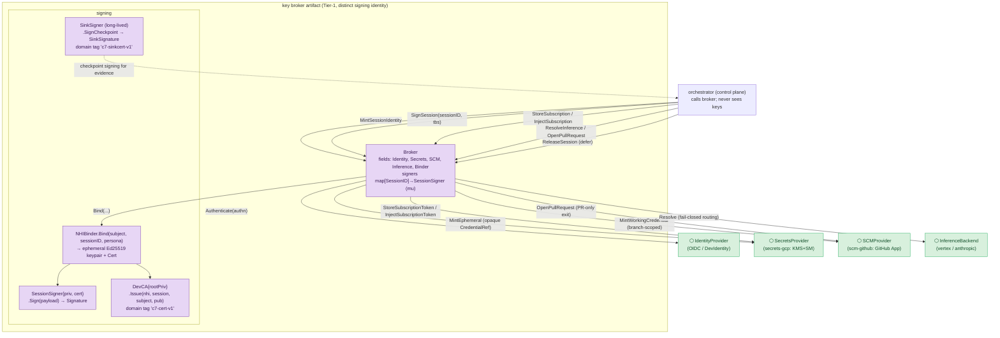
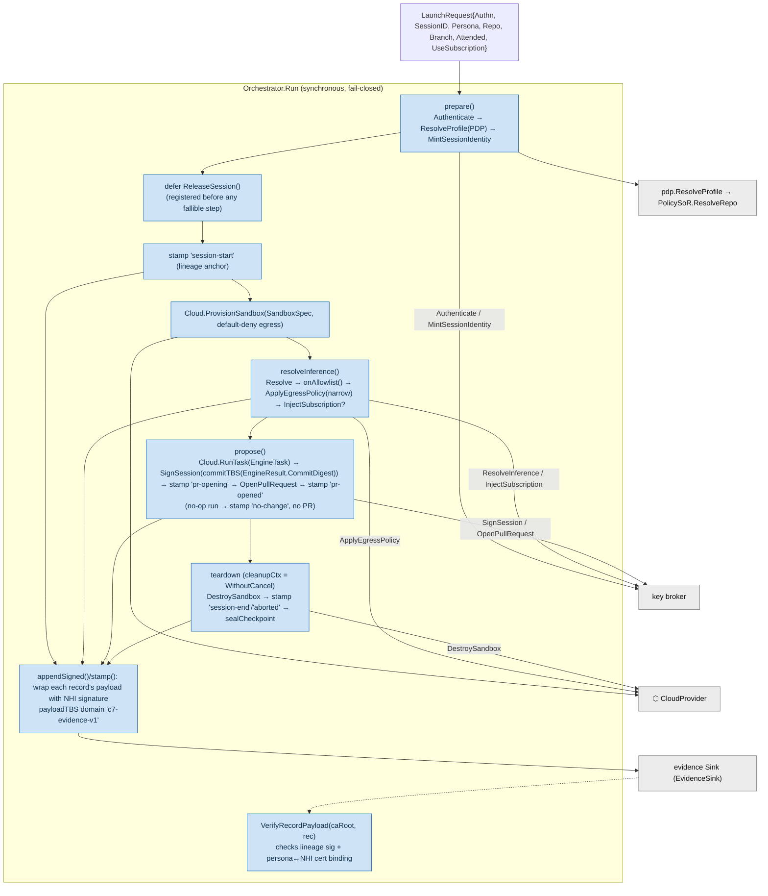
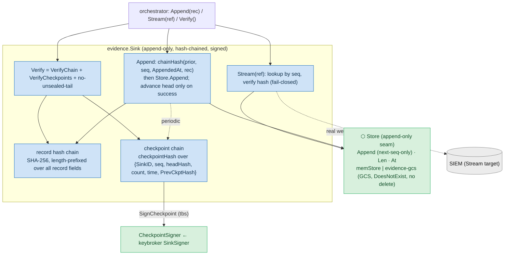

# 03 — Component View (C4 Level 3)

**Audience:** engineers modifying these containers; security reviewers tracing how keys,
lineage, and evidence integrity are actually enforced in code.
**Question answered:** *Inside the three most security- and complexity-significant
containers, what are the components, how do they collaborate, and where exactly are the
load-bearing invariants enforced?*

The three chosen containers are the ones that carry the system's hardest guarantees and
are **fully implemented today**: the **key broker** (custodies every key and signs every
artefact), the **orchestrator** (drives the lifecycle and stamps unbroken lineage), and
the **evidence sink** (the tamper-evident system of record). The placeholder containers
(`ui`, `dlp`, sandbox trio) are intentionally omitted — there is no code to decompose yet.

---

## 3.1 Key broker (`keybroker/broker` + `keybroker/signing`)

*Why this one:* it is the blast-radius-limiting component — Console7 "holds everyone's
keys," so this is peeled into a separate, separately-signed artifact (`ARCHITECTURE.md`
§6.2). The control plane never sees key material; it gets back opaque refs and signatures.

**Load-bearing invariants (read in source):**
- **Session signing keys never leave the broker.** `MintSessionIdentity` calls
  `Binder.Bind`, which generates an ephemeral Ed25519 keypair held *inside* a
  `SessionSigner`; the broker keeps it in its `signers` map and exposes only
  `SignSession`. `ReleaseSession` discards it at teardown — the key dies with the session.
- **Only opaque refs cross the seam.** Cloud and SCM credentials come back as
  `CredentialRef{Ref, Expiry}`; the subscription token is sealed/injected by the
  `SecretsProvider` and **never returned to the broker or control plane**.
- **Lineage is cryptographic.** Every `Signature` carries `{NHI, Subject, SessionID, Sig,
  Cert}` and `Verify` checks the CA-root → NHI-key → payload chain *and* that the cert's
  Subject/SessionID match. Domain-separation tags (`c7-cert-v1`, `c7-sinkcert-v1`,
  `c7-evidence-v1`, `c7-ckpt-v1`) prevent cross-context signature reuse.
- **`DevCA` is dev-only.** Ed25519 root generated in-process; production Sigstore-keyless
  / org CA is **(assumed/planned)**.

---

## 3.2 Orchestrator (`control-plane/orchestrator`)

*Why this one:* it is the most complex control-flow in the system and the single place
the **human→NHI→action lineage is stamped** (the engine's own sub-agent lineage is
leaky). It is fully synchronous and fail-closed, with cancellation-resilient teardown.

**Load-bearing invariants (read in source):**
- **Scope follows the target, not the launcher.** `prepare()` resolves the profile from
  the **repo** via `PolicySoR.ResolveRepo`; P1 admits only Author × T3/S1 and rejects
  every other coordinate fail-closed.
- **The boundary is narrowed before work runs.** The sandbox is provisioned default-deny;
  `resolveInference()` only widens egress to the *exact* resolved endpoint after
  `onAllowlist()` confirms it — a resolved URL that is not allowlisted aborts the session.
- **Subscription injection is gated.** Tokens are injected by reference only when
  `UseSubscription && Attended` (and the seam re-checks attended + single-beneficiary +
  sandbox ownership).
- **Teardown cannot be cancelled away.** All exit paths destroy the sandbox using a
  `context.WithoutCancel` clone, then seal a signed checkpoint — evidence is sealed even
  on error/abort.
- **Persona is bound to the cert, not just the bytes.** `VerifyRecordPayload` rejects a
  record whose `Persona` does not match the NHI certificate — defence against
  cross-persona forgery.

---

## 3.3 Evidence sink (`control-plane/evidence`)

*Why this one:* it is the tamper-evident system of record — the thing an auditor trusts.
Its integrity rests on two chained structures and a strict append-only store.

**Load-bearing invariants (read in source):**
- **Append-only by construction.** The `Store` seam exposes only `Append/Len/At` — no
  update or delete. `memStore` accepts a write **only** if `Ref.Sequence == len(entries)`
  ("no gaps, no rewrite"); `evidence-gcs` maps each sequence to one object and writes with
  a GCS `DoesNotExist` precondition, with a workload SA that has create/get/list but **no
  delete**.
- **The sink stamps authoritative time.** `AppendedAt` is set by the sink, never trusted
  from the caller's `ObservedAt`; two records with reversed `ObservedAt` still order by
  sink time.
- **Two chains, both verified.** `VerifyChain` recomputes every record hash from genesis;
  `VerifyCheckpoints` validates each checkpoint's **signature** (pinned to the expected
  `SinkID`), its `PrevCkptHash` link, and that its `HeadHash` matches the committed record
  — then confirms the latest checkpoint covers **all** records (no unsealed tail).
- **WORM has two strengths.** Against the workload SA it is append-only by IAM +
  precondition (tamper-*resistant*); against a privileged actor it is the signed hash
  chain (tamper-*evident*) unless the GCS **bucket-lock retention** is enabled (off by
  default — production must set it; see view [05](05-deployment.md) and `docs/RISKS.md`).

## Notes & confidence
- All three components were read in source and are implemented. Checkpoint persistence is
  currently in-memory in the Sink (durable checkpoint persistence to GCS is a tracked
  follow-up that closes the tail-truncation residual); the `evidence-gcs` *record* store is
  real and durable.
- `console7-cloud-local` supplies a **file-backed** `Store` (append-only JSONL, fsync,
  `VerifyChain` on load) — the same seam, a different durability substrate — see view
  [05](05-deployment.md).
