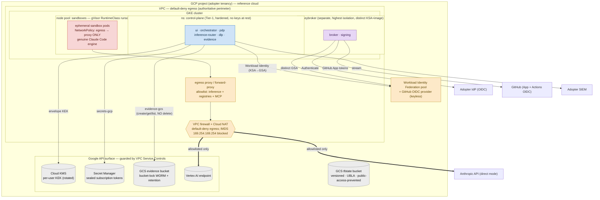
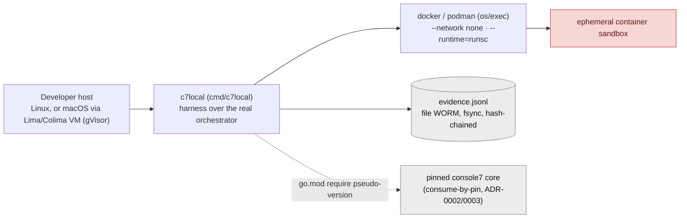

# 05 — Technical / Deployment Architecture

**Audience:** platform/SRE teams standing Console7 up; cloud security reviewers assessing
network boundaries and IAM.
**Question answered:** *Where does each piece run, on what nodes and networks, and where
are the enforced network and identity boundaries?*

The reference runtime is **Kubernetes (GKE) in the adopter's GCP project**: the control
plane as a small hardened namespace, the **key broker as a separate isolation domain**, and
**sandboxes as gVisor-isolated, ephemeral pods** network-policied to the egress perimeter
only. The cloud-specific pieces sit behind the provider seams so AWS/Azure are parity
targets. Reference cloud = GCP; reference inference = Vertex (the inference cloud is an axis
**orthogonal** to the control-plane cloud — ADR-0004).

## Nodes & hosting topology
| Plane | Runs on | Isolation / key boundary |
|---|---|---|
| Control plane | GKE namespace `control-plane` | Tier-1, hardened; **holds no keys at rest**; Workload Identity (KSA→GSA), no stored cloud keys. |
| Key broker | GKE namespace `keybroker` (separate) | Highest isolation; **distinct** GSA, **distinct image + signing identity**; the only component that handles key material. |
| Sandboxes | dedicated node pool, **gVisor `RuntimeClass=runsc`** (microVM alt.) | Untrusted, ephemeral pods; kernel/syscall confinement; `NetworkPolicy` permits egress to the proxy only. |
| Managed data services | GCP project (Google API surface) | Cloud KMS, Secret Manager, GCS evidence bucket, Vertex — fronted by **VPC Service Controls** (guards the **API surface only**, not arbitrary TCP egress). |

## Network boundaries (the authoritative controls)
- **Default-deny egress** is realised by **VPC firewall + Cloud NAT** (out-of-band), not
  the engine's in-process proxy. Sandboxes reach *only* the egress proxy, which permits
  *only* the composed allowlist (inference endpoint + approved registries + approved MCP).
- **IMDS / metadata** (169.254.169.254, the IPv6 metadata address, metadata DNS) is blocked
  at the node/pod boundary so a sandbox cannot harvest node credentials.
- **VPC Service Controls** wraps the Google API surface — important nuance: it does **not**
  bound arbitrary egress, so it is *complementary* to the firewall, not a substitute
  (`DESIGN.md` §5.2, §11).
- **Inference is the only crossing.** Vertex stays inside the project; direct-Anthropic
  leaves the tenancy. Either way the destination must be on the allowlist or the firewall
  denies it.

## Identity & IAM (least privilege, from the Terraform)
- **secrets module** (✅ real): KMS key ring + auto-rotated **KEK** (`prevent_destroy`); a
  workload SA with **no human-impersonation binding**; two custom roles split by scope —
  project-scoped `secrets.create` and a name-prefix-conditioned `versions.add/access/delete`
  on `{prefix}-sub-*` only.
- **evidence module** (✅ real): hardened GCS bucket (UBLA, public-access-prevention,
  versioning, retention) with an **authoritative** bucket IAM policy and a custom
  `evidence_writer` role = **create/get/list only (no delete/update/setIamPolicy)**;
  bucket-lock `is_locked=false` by default (tamper-evident) and **must be set true in
  production** (tamper-resistant; `docs/RISKS.md` R-2).
- **inference-vertex module** (✅ real): one custom role with **only**
  `aiplatform.endpoints.predict` bound to the existing workload SA — no enumeration, no
  deploy, no self-grant.
- **gke** and **networking** modules are **(planned/stub)** — reserved for the boundary-first
  sandbox PR (GKE gVisor node pool + Workload Identity binding; VPC/firewall/NAT/NetworkPolicy).

## Deploy-time topology (provisioning identities)
Provisioning is **keyless**: GitHub Actions in the adopter's `console7-deploy[-template]`
repo federate to GCP via WIF and assume one of two split service accounts (see view
[07](07-technology-lifecycle-controls.md) for the full pipeline):
- **PLAN SA** — `roles/viewer` + `securityReviewer`, **any branch**, read-only `terraform plan` on PRs.
- **APPLY SA** — admin-grade (KMS/IAM/serviceusage/storage), **`refs/heads/main` only**,
  `terraform apply` behind an optional protected environment. State lives in the versioned
  GCS `tfstate` bucket; the PLAN SA cannot reach the state lock.

## Release artifacts (distinct trust tiers)
Per `ARCHITECTURE.md` §6.4 / `DESIGN.md` §8, four artifacts ship with **distinct signing
identities**: control-plane image, **key-broker image**, **sandbox base image** (runs
untrusted code — must not share a build identity with the key holder), and the SDK packages.
The Dockerfiles/build pipelines for these images are **(assumed/planned)** — not in tree at
this commit (see view [08](08-dependency-supply-chain.md)).

## Local / cloudless target (`console7-cloud-local`)
A dogfood topology with **no cloud**: a Docker/Podman-backed `CloudProvider` runs each
session as an ephemeral container (`--network none` from birth; gVisor `--runtime=runsc`,
with a documented dev-only plain-container fallback that relaxes *syscall* isolation but
**never** egress), a **file-backed WORM** evidence `Store` (append-only JSONL, fsync,
`VerifyChain` on load), and a harness driving the real core orchestrator. It **consumes
core by pin** (go.mod pseudo-version, no fork).

## Notes & confidence
- The managed-service IAM/topology (KMS/SM/GCS/Vertex) is grounded in real Terraform; the
  **GKE cluster, VPC/firewall/NAT, node pools, egress proxy, and NetworkPolicy** are drawn
  per `ARCHITECTURE.md` §4 and `DESIGN.md` §5 but their Terraform is **(planned/stub)** — so
  treat the in-cluster topology as the specified target, not yet-provisioned code.
- HA posture (single-region / multi-region active-active / break-glass) is an **adopter
  configuration choice**, not a fixed feature (`ARCHITECTURE.md` §4) — **(assumed)** here.
