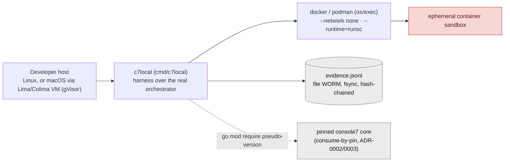

# 05 — Technical / Deployment Architecture

**Audience:** platform/SRE teams standing Console7 up; cloud security reviewers assessing
network boundaries and IAM.
**Question answered:** *Where does each piece run, on what nodes and networks, and where
are the enforced network and identity boundaries?*

The reference runtime is **Kubernetes (GKE) in the adopter's GCP project**: the control
plane as a small hardened namespace, the **key broker as a separate isolation domain**, and
**sandboxes as gVisor-isolated, ephemeral pods** network-policied to the egress perimeter
only. The cloud-specific pieces sit behind the provider seams so AWS/Azure are parity
targets. Reference cloud = GCP; reference inference = Vertex (the inference cloud is an axis
**orthogonal** to the control-plane cloud — ADR-0004).

Legend: solid = implemented & landed · **faded + dashed = target state** (not yet coded & landed). After #39/#41/#43/#57 every box here is landed — the per-session out-of-band egress **proxy** is rendered by `providers/cloud-gcp` (#57, B8), and its egress/metadata-deny was **live-proven** (B11 PoC, 2026-06-23).

```mermaid
flowchart TB
  subgraph GCP["GCP project (adopter tenancy) — reference cloud"]
    direction TB

    subgraph VPC["VPC — default-deny egress (authoritative perimeter)"]
      direction TB
      FW{{"VPC firewall + Cloud NAT<br/>default-deny egress; IMDS 169.254.169.254 blocked"}}
      PROXY["per-session egress proxy — Squid (#57)<br/>out-of-band FQDN allowlist: inference (+ approved registries/MCP)"]
      AUTHPRX["per-session Vertex auth-proxy<br/>holds the control-plane-delivered bearer<br/>(sandbox stays credential-free + metadata-free)"]

      subgraph GKE["GKE cluster"]
        direction TB
        subgraph NSCP["ns: control-plane (Tier-1, hardened, no keys at rest)"]
          CPP["ui · orchestrator · pdp<br/>inference-router · dlp · evidence"]
        end
        subgraph NSKB["ns: keybroker (separate, highest isolation, distinct KSA+image)"]
          KBP["broker · signing"]
        end
        subgraph NPSB["node pool: sandboxes — gVisor RuntimeClass runsc"]
          SBP["ephemeral sandbox pods<br/>NetworkPolicy: egress &rarr; proxy ONLY<br/>genuine Claude Code engine<br/>+ git + ca-certificates (#48)"]
        end
      end
    end

    subgraph APIS["Google API surface — guarded by VPC Service Controls"]
      direction LR
      KMS[("Cloud KMS<br/>per-user KEK (rotated)")]
      KMSS[("Cloud KMS — keybroker signing key<br/>EC-P256 AsymmetricSign (distinct identity)")]
      SM[("Secret Manager<br/>sealed subscription tokens")]
      GCSE[("GCS evidence bucket<br/>bucket-lock WORM + retention")]
      VTX[("Vertex AI endpoint")]
      AR[("Artifact Registry<br/>sandbox base-image repo<br/>immutable tags")]
    end

    WIF["Workload Identity Federation pool<br/>+ GitHub OIDC provider (keyless)"]
    TFS[("GCS tfstate bucket<br/>versioned · UBLA · public-access-prevented")]
  end

  IDP["Adopter IdP (OIDC)"]
  GH["GitHub (App + Actions OIDC)"]
  SIEM["Adopter SIEM"]
  ANT["Anthropic API (direct mode)"]

  %% identity + data bindings
  CPP -->|"Workload Identity (KSA→GSA)"| WIF
  KBP -->|"distinct GSA"| WIF
  CPP -->|"secrets-gcp"| SM
  CPP -->|"envelope KEK"| KMS
  CPP -->|"evidence-gcs (create/get/list, NO delete)"| GCSE
  CPP -->|"stream"| SIEM
  KBP -->|"Authenticate"| IDP
  KBP -->|"GitHub App tokens"| GH
  KBP -->|"AsymmetricSign (EC-P256, key never leaves KMS)"| KMSS

  %% sandbox image pull (kubelet, node SA, repo-scoped reader)
  NPSB -->|"repo-scoped pull (node SA)"| AR

  %% sandbox egress path (the only way out)
  SBP --> PROXY --> FW
  FW ==>|"allowlisted only"| ANT
  %% Vertex lane: engine reaches the per-session auth-proxy directly (NO_PROXY bypasses Squid);
  %% the auth-proxy attaches the delivered bearer and egresses via NAT to Vertex.
  SBP -->|"Vertex (skip-auth; direct hop)"| AUTHPRX
  KBP -->|"deliver Vertex bearer (to the auth-proxy, NOT the sandbox)"| AUTHPRX
  AUTHPRX --> FW
  FW ==>|"allowlisted only"| VTX

  classDef tier1 fill:#cfe3f7,stroke:#1168bd,color:#11304a;
  classDef broker fill:#e7d6f5,stroke:#7b3fab,color:#3a1d52;
  classDef dp fill:#f7d6d6,stroke:#c0392b,color:#5b1b14;
  classDef store fill:#ececec,stroke:#888,color:#111;
  classDef net fill:#fde9c8,stroke:#b8860b,color:#5c4500;
  classDef netPlan fill:#fdf5e8,stroke:#e3cda0,color:#ab9a7a,stroke-dasharray:5 4;
  %% faded + dashed = target state (not yet coded & landed); solid = implemented & landed
  class CPP tier1;
  class KBP broker;
  class SBP dp;
  class KMS,KMSS,SM,GCSE,VTX,AR,TFS store;
  class FW,WIF,PROXY,AUTHPRX net;
```

## Nodes & hosting topology
| Plane | Runs on | Isolation / key boundary |
|---|---|---|
| Control plane | GKE namespace `control-plane` | Tier-1, hardened; **holds no keys at rest**; Workload Identity (KSA→GSA), no stored cloud keys. |
| Key broker | GKE namespace `keybroker` (separate) | Highest isolation; **distinct** GSA, **distinct image**, and a **distinct KMS-backed signing identity** (EC-P256 Cloud KMS key, `signerVerifier` only — the CA private key never leaves KMS); the only component that handles key material. |
| Sandboxes | dedicated node pool, **gVisor `RuntimeClass=runsc`** (microVM alt.) | Untrusted, ephemeral pods; kernel/syscall confinement; `NetworkPolicy` permits egress to the proxy only. |
| Managed data services | GCP project (Google API surface) | Cloud KMS, Secret Manager, GCS evidence bucket, Vertex — fronted by **VPC Service Controls** (guards the **API surface only**, not arbitrary TCP egress). |

## Network boundaries (the authoritative controls)
- **Default-deny egress** is realised by the **VPC firewall** (out-of-band), not the engine's
  in-process proxy. The static **default-DENY egress floor** is landed (PR #39); the **gVisor
  cluster + sandbox node pool + Cloud NAT** for the *sanctioned* path are landed (`modules/gke`),
  and the `CloudProvider` that programs the **per-session egress NetworkPolicy** is landed
  (`providers/cloud-gcp`, PR #41). The **out-of-band egress proxy** that enforces the composed FQDN
  allowlist (inference endpoint + approved registries + approved MCP) is **landed** — `providers/cloud-gcp`
  renders one per-session Squid per `<id>-proxy` namespace (`renderPerSessionProxy`/`renderSquidConf`,
  #57/B8), the sandbox NetworkPolicy pins egress to it, and its egress/metadata-deny was **live-proven**
  (B11 PoC, 2026-06-23).
- **IMDS / metadata** (169.254.169.254, the IPv6 metadata address, metadata DNS) is **not** a VPC
  control — GCP always allows VM→metadata traffic — so the authoritative block is **node config**:
  the GKE metadata server in **`GKE_METADATA` mode** on the sandbox node pool, which *conceals* the
  node service account (**not** "disable Workload Identity", which leaves `GCE_METADATA` and
  *exposes* the node SA token). Landed with `modules/gke`; `providers/cloud-gcp` `New()` preflights
  it. PR #39 deliberately does not pretend to enforce it at the VPC.
- **VPC Service Controls** wraps the Google API surface — important nuance: it does **not**
  bound arbitrary egress, so it is *complementary* to the firewall, not a substitute
  (`DESIGN.md` §5.2, §11).
- **Inference is the only crossing.** Vertex stays inside the project; direct-Anthropic
  leaves the tenancy. Either way the destination must be on the allowlist or the firewall
  denies it.

## Identity & IAM (least privilege, from the Terraform)
- **secrets module** (✅ real): KMS key ring + auto-rotated **KEK** (`prevent_destroy`); a
  workload SA with **no human-impersonation binding**; two custom roles split by scope —
  project-scoped `secrets.create` and a name-prefix-conditioned `versions.add/access/delete`
  on `{prefix}-sub-*` only. The SA also holds `roles/iam.serviceAccountTokenCreator`
  **scoped to itself** (self-impersonation) so it can mint the short-lived GCP access token
  the Vertex inference lane injects (`InjectInferenceCredential`) — no broader impersonation.
- **keybroker-signing module** (✅ real): a **separate** Cloud KMS asymmetric **EC-P256**
  signing key in its own key ring, plus a **distinct** signing SA holding
  `roles/cloudkms.signerVerifier` on that key only. This is the keybroker's CA root — the
  lineage trust anchor (NHI binding certs + evidence checkpoints sign under it) — kept
  cryptographically and by-identity **distinct from the secrets KEK** (tenet: the key
  broker is a separate artifact with a distinct signing identity; never fused).
- **evidence module** (✅ real): hardened GCS bucket (UBLA, public-access-prevention,
  versioning, retention) with an **authoritative** bucket IAM policy and a custom
  `evidence_writer` role = **create/get/list only (no delete/update/setIamPolicy)**;
  bucket-lock `is_locked=false` by default (tamper-evident) and **must be set true in
  production** (tamper-resistant; `docs/RISKS.md` R-2).
- **inference-vertex module** (✅ real): one custom role with **only**
  `aiplatform.endpoints.predict` bound to the existing workload SA — no enumeration, no
  deploy, no self-grant.
- **artifact-registry module** (✅ real): one **DOCKER** repository (`name_prefix`, regional,
  `immutable_tags`) for the sandbox base-image + a **repo-scoped** `roles/artifactregistry.reader`
  on the GKE node SA — replacing the project-wide reader the `gke` module used to grant against no
  repository (least privilege; the node pulls *this* image and no other repo's). Mints no identity;
  grants no push/delete/admin. The bootstrap APPLY SA gains `roles/artifactregistry.admin` (the
  least over-grant covering repo-create + repo-IAM).
- **networking module** (✅ real, PR #39): the static default-deny egress **floor** — custom-mode
  VPC + sandbox subnet (flow logs, private Google access) + one **default-DENY egress** firewall
  rule scoped to the sandbox node tag (logged). Boundary-first; the tagged node pool that activates
  it is landed in `modules/gke` (below).
- **gke** module (✅ landed, PR-2b): hardened regional GKE cluster (Dataplane V2 NetworkPolicy
  enforcement; cluster Workload Identity; private nodes; master-authorized-networks; shielded
  nodes) + gVisor sandbox node pool (`sandbox_config gvisor`; sandbox node tag; `GKE_METADATA`
  node-SA concealment; structural gVisor taint) + control-plane pool + least-privilege node SA +
  WI binding (control KSA → secrets SA) + Cloud Router/NAT for the sanctioned egress path +
  namespace-TTL reaper. The per-session NetworkPolicy **and** the out-of-band per-session Squid proxy
  (composed FQDN allowlist) are programmed/rendered at runtime by `providers/cloud-gcp` (#41/#57);
  the full sandbox boundary is landed and live-proven (B11 PoC).

## Deploy-time topology (provisioning identities)
Provisioning is **keyless**: GitHub Actions in the adopter's `console7-deploy[-template]`
repo federate to GCP via WIF and assume one of two split service accounts (see view
[07](07-technology-lifecycle-controls.md) for the full pipeline):
- **PLAN SA** — `roles/viewer` + `securityReviewer`, **any branch**, read-only `terraform plan` on PRs.
- **APPLY SA** — admin-grade (KMS/IAM/serviceusage/storage), **`refs/heads/main` only**,
  `terraform apply` behind an optional protected environment. State lives in the versioned
  GCS `tfstate` bucket; the PLAN SA cannot reach the state lock.

## Release artifacts (distinct trust tiers)
Per `ARCHITECTURE.md` §6.4 / `DESIGN.md` §8, four artifacts ship with **distinct signing
identities**: control-plane image, **key-broker image**, **sandbox base image** (runs
untrusted code — must not share a build identity with the key holder), and the SDK packages.
For the **sandbox base image** this is now real: the **release pipeline**
(`.github/workflows/sandbox-image-release.yml`, ✅) builds it (digest-pinned bases), attaches an
**SBOM** + **SLSA provenance**, and **keyless-signs** it (GitHub OIDC → Sigstore; distinct identity
**enforced** via an always-on wrong-identity-rejection test), publishing the reference to
`ghcr.io`. The adopter verifies (`scripts/verify-sandbox-image.sh`) and mirrors it into their
in-tenancy `modules/artifact-registry` (✅, `immutable_tags` + repo-scoped node-SA pull) — the node
pulls in-region (tenet 1). The consumer-side **digest pin** is enforced: `providers/cloud-gcp`
`Config.SandboxImage` (✅, B3) **rejects a tag-only reference** so the pod runs the content-addressed
`@sha256` bytes. The control-plane / key-broker image pipelines remain **(planned)** (see
view [08](08-dependency-supply-chain.md)).

## Local / cloudless target (`console7-cloud-local`)
A dogfood topology with **no cloud**: a Docker/Podman-backed `CloudProvider` runs each
session as an ephemeral container (`--network none` from birth; gVisor `--runtime=runsc`,
with a documented dev-only plain-container fallback that relaxes *syscall* isolation but
**never** egress), a **file-backed WORM** evidence `Store` (append-only JSONL, fsync,
`VerifyChain` on load), and a harness driving the real core orchestrator. It **consumes
core by pin** (go.mod pseudo-version, no fork).

## Notes & confidence
- The managed-service IAM/topology (KMS/SM/GCS/Vertex), the **VPC + sandbox subnet + default-DENY
  egress floor** (PR #39), and the **GKE cluster, node pools, Cloud NAT, WI binding, and reaper**
  (PR-2b) are grounded in real Terraform; the per-session **NetworkPolicy** is programmed at
  runtime by `providers/cloud-gcp` (PR #41), as is the **out-of-band per-session Squid proxy** (its
  composed FQDN allowlist, #57/B8). The whole sandbox egress boundary — VPC floor + NetworkPolicy +
  per-session proxy + metadata concealment — is landed and was **live-proven end-to-end** (the B11 PoC
  on 2026-06-23: genuine engine run with non-allowlisted-host and metadata deny verified through the proxy).
- HA posture (single-region / multi-region active-active / break-glass) is an **adopter
  configuration choice**, not a fixed feature (`ARCHITECTURE.md` §4) — **(assumed)** here.
