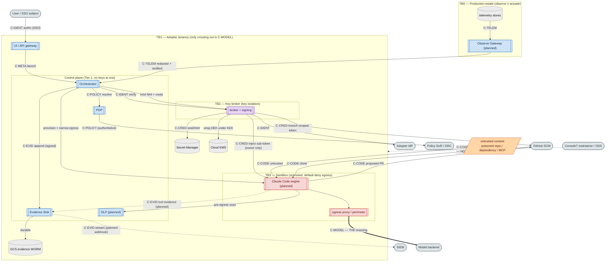

# 06 — Data Flow & Trust Boundaries (STRIDE-ready DFD)

**Audience:** threat modellers, security architects, 2LoD/assurance reviewers.
**Question answered:** *What data of what classification moves where, which trust
boundaries does it cross, and what is the threat/mitigation posture at each crossing?*

This is the diagram a regulated adopter cares about most: **what stays in-tenant vs what
crosses the boundary**. The single most important fact — repeated from
`ARCHITECTURE.md` §3 — is that **only model prompts/responses (`C-MODEL`) ever leave the
adopter's tenancy**.

### Data classifications
| Tag | Class | Examples |
|---|---|---|
| `C-CRED` | Credentials / keys | subscription OAuth token, minted cloud/SCM creds, NHI signing keys |
| `C-CODE` | Source / repo contents | cloned repo, diffs, PRs, **untrusted** dependency content |
| `C-MODEL` | Model I/O | prompts + completions (**the only boundary crossing**) |
| `C-EVID` | Evidence / audit | hash-chained signed records, checkpoints, transcripts |
| `C-POLICY` | Policy data | tier × stratum, session profile, egress allowlist |
| `C-IDENT` | Identity | SSO assertion, Subject, per-session NHI |
| `C-TELEM` | Production telemetry | logs/metrics/traces (redacted at the gateway) |
| `C-META` | Session metadata | session id, persona, repo ref |

## Residency table (what crosses TB1)
| Asset / flow | Class | Location | Crosses to model backend? |
|---|---|---|---|
| Source code, repo contents | `C-CODE` | SCM + sandbox | No |
| Tool execution, filesystem, processes | — | Sandbox (adopter cloud) | No |
| Cloud & SCM credentials | `C-CRED` | Broker + Secret Manager | No |
| Subscription OAuth token | `C-CRED` | Per-user vault (KMS-sealed) | No — authenticates the user's own session only |
| Production telemetry | `C-TELEM` | Observe Gateway | No |
| Evidence, transcripts, audit | `C-EVID` | WORM + SIEM | No |
| **Model prompts & responses** | `C-MODEL` | — | **Yes — to the chosen backend** |

## Trust boundaries & STRIDE posture
| TB | Boundary | Top STRIDE threats | Authoritative mitigation (✅ impl / ◻ planned) |
|---|---|---|---|
| **TB1** | Adopter tenancy ↔ outside | **I**nfo-disclosure (exfil of code/creds); **T**ampering of egress dest | ✅ default-deny egress allowlist; ✅ single named crossing (inference); ◻ pre-egress DLP for T1/T2; ✅ maintainer receives nothing (no phone-home) |
| **TB2** | Control plane ↔ key broker | **E**oP (control-plane compromise reaches keys); **S**poofing of lineage | ✅ separate artifact + distinct signing identity; ✅ keys never returned to control plane (opaque refs); ✅ NHI signing keys custodied in broker, die with session |
| **TB3** | Control/data plane ↔ sandbox | **I**nfo-disclosure via lethal trifecta; **T**ampering by untrusted code; **E**oP out of sandbox | ✅ gVisor syscall confinement (target); ✅ default-deny egress from birth; ✅ ephemeral + irreversible teardown; ◻ no-prod-data default; ◻ MCP allowlist |
| **TB4** | Maintainer ↔ adopter | **T**ampering (supply-chain); **S**poofing of releases | ✅ pinned deps + SHA-pinned actions + gitleaks/govulncheck/CodeQL; ◻ SBOM + SLSA L3 provenance + signed releases (tracked targets) — see view [07](07-technology-lifecycle-controls.md)/[08](08-dependency-supply-chain.md) |
| **TB5** | Session ↔ production estate | **T**ampering (unauthorised mutation); **R**epudiation | ✅ "observe ≠ actuate" design; ◻ read-only operate IAM (authoritative); ◻ Observe Gateway redaction + query audit; ◻ PreToolUse mutating-command tripwire; ✅ PR-only exit (no merge/actuate) |
| **AuthN** | User ↔ UI | **S**poofing of identity | ✅ cryptographic SSO assertion verification; ✅ groups from IdP (no self-assert) |

## Mapped abuse cases (from `docs/THREAT-MODEL.md` / `DESIGN.md` §10)
1. **Control-plane-as-target** → TB2: broker holds keys, per-user envelope, no operator
   read path, expiry caps. (✅ behavioural invariants proven; cryptographic-boundary
   hardening continues P1+.)
2. **Lethal trifecta / indirect prompt injection** → TB1/TB3: remove a leg (default-deny
   egress ✅, no-prod-data ◻, MCP allowlist ◻) + pre-egress DLP ◻.
3. **Cross-tier escalation** → AuthZ: take-the-max + step-up; scope from target's tier ×
   stratum, never the launcher. (◻ P3; P1 admits only Author × T3/S1, fail-closed.)
4. **Subscription-credential misuse / unattended drift** → TB2/TB1: attended +
   single-beneficiary gate at `Resolve` and `InjectSubscriptionToken`; per-user, no pooling.
   (✅ seam-enforced.)
5. **Sub-agent lineage break** → TB2/Evidence: orchestrator-stamped lineage; persona bound
   to NHI cert. (✅ for lifecycle records; per-tool-call sandbox emission ◻ P1/P2.)
6. **Platform supply-chain compromise** → TB4: repo's own SDLC standard + gates. (✅ preventative; artifact signing ◻.)

## Notes & confidence
- Flows from/to the **sandbox engine**, the **Observe Gateway**, **DLP**, and the **SIEM
  webhook** are **(planned)** — their containers are scaffolds; the data classifications and
  boundary crossings are drawn from the normative spec and the seam contracts.
- A residual worth stating: the subscription token is, unavoidably, **agent-readable inside
  its own session** (`THREAT-MODEL.md` §4). The mitigation is blast-radius, not prevention:
  per-user isolation, no pooling, default-deny egress, and (planned) DLP.
