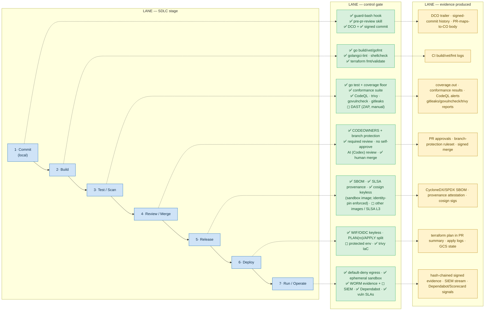

# 07 — Technology Lifecycle & Controls (SDLC swimlanes)

**Audience:** the repo's own 2LoD/assurance function, supply-chain reviewers, contributors.
**Question answered:** *As a change moves commit → build → test → review → release → deploy
→ run, what control gate applies at each stage, and what evidence does that gate produce?*

Console7 **governs itself**: it is a Tier-1 × (S1 Engineered + S5 Agentic) tailoring of a
19-control-objective secure-SDLC standard (`docs/standards/console7-sdlc-standard.md`),
bound to an OpenSSF posture (Scorecard, OSPS Baseline L3, Best-Practices Badge silver). The
gates below are **as-code and CI-enforced**; the in-band hooks are defence-in-depth (tenet
2) that front-run the authoritative CI + branch-protection controls.

Legend: ✅ live · ◻ tracked target (no artifact/service yet). The Release gate is now **partially live** — the sandbox base image is signed (keyless) / SBOM'd / provenanced; the other images + SLSA-L3 attestation remain target.

## CI gates (each is a `.github/workflows/*` job — actions SHA-pinned)
| Workflow | Trigger | Enforces | CO | Evidence |
|---|---|---|---|---|
| `secret-scan.yml` | PR, push | gitleaks over **full history** (binary SHA-verified) | CO-8.1 | gitleaks audit; clean tree |
| `dco.yml` | PR | `Signed-off-by` on every human commit (bots exempt) | CO-4 | sign-off check |
| `go.yml` | PR, push | build · vet · test · **coverage floor** · gofmt · golangci-lint (whole-tree) | CO-15, CO-17 | CI logs; `coverage.out` |
| `dep-scan.yml` | PR, push | `govulncheck ./...` | CO-5.5, CO-11 | vuln report |
| `codeql.yml` | PR, push, weekly | Go SAST (security-extended) | CO-7.1 | CodeQL alerts |
| `terraform.yml` | PR, push | `terraform fmt`/`validate` + **trivy** config scan | CO-9, CO-7.1 | trivy report |
| `shellcheck.yml` | PR, push | shell lint of `deploy/**/*.sh` | CO-17 | shellcheck report |
| `dockerfile-lint.yml` | PR, push | hadolint (digest-pinned image) of the sandbox base image | CO-17, CO-5 | hadolint report |
| `sandbox-image-release.yml` | tag `sandbox-image/v*`; push (self-test) | build → SBOM + provenance → **cosign keyless sign** → verify; **identity-pin enforcement** self-test (org/workflow/ref lookalikes rejected) | CO-5.2/5.4, CO-8 *(5.3 L3 partial — BuildKit provenance, not the hardened SLSA-L3 builder)* | SBOM + provenance attestations · cosign sigs · enforcement-test log |
| `governance-gate.yml` | PR, push | `audit-skill-provenance.sh` — `.claude/` skills/agents/hooks first-party only (**blocking**) | CO-12.7/12.8 | provenance audit |
| `architecture-docs.yml` | PR, push | `validate-architecture-mermaid.py` — Mermaid soundness of `docs/architecture/` (**blocking**) + non-blocking drift `::warning::` | CO-14, CO-17 | validator result; drift annotation |
| `dast-zap.yml` | manual | ZAP baseline (report-only) | CO-7.2 | ZAP report ◻ |
| conformance | `go test ./conformance/...` | provider contract assertions (7 of 9 seams live) | CO-14, CO-15 | conformance results |

## Deploy pipeline (adopter repos `console7-deploy[-template]`)
Keyless, split-identity, observe-before-actuate:
- **Plan** (PR): checkout core at pinned `CONSOLE7_REF`, `auth` via WIF→**PLAN SA**
  (read-only, any branch), `terraform plan -lock=false`, plan posted to the PR summary.
  Permissions `contents:read` + `id-token:write` only.
- **Apply** (push to `main`, `workflow_dispatch` on the template's first run): WIF→**APPLY
  SA** (admin, `refs/heads/main` only), optional **protected environment**
  (`console7-apply`, required reviewers), `terraform apply`. The PLAN SA cannot reach the
  state lock — separation by design (tenet 5; "observe ≠ actuate").

## Control-objective disposition (selected, from the SDLC standard)
- **Adopted & live:** CO-4 (source integrity/DCO/signed/branch-protection), CO-5
  (supply-chain pinning + Dependabot + Socket), CO-7.1 (SAST/secrets/SCA/IaC), CO-8
  (no secrets at rest), CO-12 (AI/agentic: provenance gate, human merge, no agent
  self-merge), CO-14 (evidence: git + signed history + **PR maps each change to its CO**),
  CO-15/CO-17 (QA + code quality), CO-1/CO-2/CO-11/CO-18.
- **Partially adopted (first signed artifact landed):** an **SBOM** (CO-5.2) and a **keyless-signed
  release with a distinct, enforced identity** (CO-5.4) are **live for the sandbox base image**
  (`sandbox-image-release.yml`), plus **build provenance** (a step toward CO-5.3). Still tracked:
  the control-plane/key-broker images, **full SLSA-L3** attestation (CO-5.3 needs the hardened
  ephemeral builder, not stock BuildKit provenance), and admission-time signature verification.
- **Tracked targets (dated, with interim slices in `RISKS.md`/standard §5):** independent
  human reviewer + `enforce_admins` (single-maintainer gap), the remaining image pipelines +
  SLSA-L3 + admission (CO-5.2–5.4), DAST/IAST (CO-7.2), independent pentest (CO-7.4), fuzzing,
  agent behavioural-eval suite (CO-12.10).
- **Dropped (reasoned N/A):** CO-10 (nothing deployed *from this repo*), CO-13 (no
  low-code), CO-19 (no regulated trading systems).

## Cross-cutting (continuous)
- **Supply chain:** Socket Firewall (`sfw`) or lockfile-faithful installs; **everything
  pinned** (Go releases; actions to full SHA); Dependabot weekly for actions + gomod;
  `socket.yml`; never `curl … | sh` (hook-blocked). See view [08](08-dependency-supply-chain.md).
- **Exception register:** every conscious gate deviation is tracked in `docs/RISKS.md`
  (currently R-1 gosec G115 on bounded length-prefix codecs; R-2 trivy GCP-0077 superseded
  by Cloud Audit Logs) — debt named, never silently absorbed (CO-17).
- **Upstream Claude Code:** pinned and **canaried** before fleet rollout (a permission/hook
  change upstream can shift behaviour) — `DESIGN.md` §1.4. **(process; automation planned)**

## Notes & confidence
- Stages 1–4 and 6 are **live** (hooks, all CI workflows, branch protection, the deploy
  repos' plan/apply workflows were read in source). **Stage 5 (Release)** is now **partially
  live**: the sandbox base image has a real build → SBOM → SLSA-provenance → keyless-sign →
  verify pipeline with an enforced distinct identity (`sandbox-image-release.yml`); the
  control-plane/key-broker image pipelines, SLSA-L3, and admission-time verification are still
  tracked. **Stage 7 (Run)** mixes live evidence (WORM hash chain) with planned runtime controls
  (out-of-band egress proxy, live SIEM webhook).
- The "AI (Codex) review" leg in stage 4 reflects the project's stated authoritative
  external review gate (CLAUDE.md tenet 2); it is **(assumed)** from process docs, not a
  workflow file in-tree.
