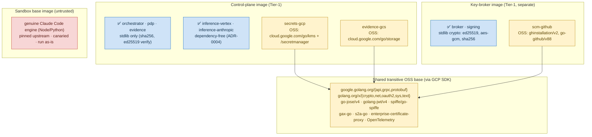

# 08 — Dependency / Supply-Chain View

**Audience:** supply-chain/OSS reviewers, security engineers assessing third-party blast
radius, anyone bumping a dependency.
**Question answered:** *What is first-party vs third-party, what notable OSS does Console7
pull, where does each land in the runtime, and how is the surface kept small?*

The headline property: **the core is import-free of third-party code.** `sdk/`,
`control-plane/`, and `keybroker/` build on the **Go standard library only** (Ed25519,
AES-256-GCM, SHA-256, `encoding/*`, `context`, `sync`). Every third-party dependency is
confined to **three reference providers**, and the two inference backends are deliberately
**dependency-free** (pure routing — `docs/adr/0004`). This is a Tier-1, public,
security-sensitive codebase keeping the smallest dependency surface that still ships a real
GCP reference set.

## Direct dependencies (from `go.mod`, all pinned, `go.sum` committed)
| Module | Version | Used by | Runtime plane | Purpose |
|---|---|---|---|---|
| `cloud.google.com/go/kms` | v1.31.0 | `secrets-gcp` | control plane | envelope-encrypt per-user DEK under KEK |
| `cloud.google.com/go/secretmanager` | v1.20.0 | `secrets-gcp` | control plane | sealed subscription-token storage |
| `cloud.google.com/go/storage` | v1.62.3 | `evidence-gcs` | control plane | append-only WORM object store |
| `github.com/bradleyfalzon/ghinstallation/v2` | v2.19.0 | `scm-github` | key broker | GitHub App → installation tokens |
| `github.com/google/go-github/v88` | v88.0.0 | `scm-github` | key broker | GitHub REST (PRs, installs) |
| `google.golang.org/api` | v0.274.0 | GCP providers | control plane | Google API client base |
| `google.golang.org/grpc` | v1.80.0 | GCP providers | control plane | transport |
| `google.golang.org/protobuf` | v1.36.11 | GCP providers | control plane | wire format |

Notable indirect (security-relevant): `golang.org/x/crypto`, `github.com/go-jose/go-jose/v4`,
`github.com/golang-jwt/jwt/v4` (JWT/JOSE for GitHub App + OAuth), `cloud.google.com/go/auth`
+ `golang.org/x/oauth2` (token exchange), `github.com/spiffe/go-spiffe/v2`,
`enterprise-certificate-proxy`, and the OpenTelemetry suite (pulled transitively by the GCP
SDK). The closure raised the toolchain to **`go 1.25.11`** — pinned to a *patched* 1.25.x
specifically so `govulncheck` stays clean of `.0` stdlib CVEs.

## First-party vs third-party, and the confinement boundary
- **First-party, zero third-party imports:** `sdk/interfaces`, `sdk/testkit`, `sdk/devkit`,
  all of `control-plane/`, all of `keybroker/`, and `providers/inference-{vertex,anthropic}`.
- **First-party that pulls OSS (confined behind hexagonal *ports*, faked for tests):**
  `providers/secrets-gcp`, `providers/evidence-gcs`, `providers/scm-github`. The GCP/GitHub
  SDK clients never leak outside the adapter files (`*_gcp.go`, `ghapp_auth.go`); the rest of
  the provider is testable with in-memory fakes — and the conformance suite runs the real
  provider *logic* against those fakes, no cloud/network needed.
- **Out-of-tree / community providers** (e.g. `cloud-aws`, `secrets-vault`, `scm-gitlab`)
  live in their own repos against the published SDK — **(assumed/future)**; core ships the
  **reference set only**.

## Tooling supply chain (build/test, not shipped at runtime)
All pinned and checksum-/SHA-verified (CI installs the exact version): `golangci-lint`
v2.12.2 (built from source via checksum-verified proxy), `govulncheck` v1.1.4, `gitleaks`
v8.21.2 (binary SHA256-verified before run), `trivy` v0.70.0, `terraform` v1.12.2. GitHub
Actions are **SHA-pinned**; Dependabot refreshes actions + gomod weekly; installs route
through **Socket Firewall** or a lockfile-faithful path; `curl | sh` is hook-blocked.

## The wrapped engine — a distinct supply-chain axis
The genuine **Claude Code engine** (Node/Python) is not a Go dependency; it is **wrapped,
not reimplemented**, run as-is in the sandbox over its CLI/Agent SDK. It is a separately
**pinned upstream** whose upgrades are **canaried** before fleet rollout because an upstream
change can shift permission/hook behaviour (`DESIGN.md` §1.4). It lives only in the
**sandbox base image** — never in the control-plane or key-broker images.

## `console7-cloud-local` dependency posture
Out-of-tree, **consume-by-pin**: `go.mod` requires `github.com/console7/console7` at a
pinned pseudo-version (no `replace`, no fork). Otherwise **stdlib-only** — the Docker/Podman
CloudProvider shells out via `os/exec` rather than importing a container-runtime SDK,
keeping its third-party surface at zero beyond pinned core.

## Notes & confidence
- Direct/indirect versions are read from `go.mod`; runtime placement (which image a provider
  lands in) follows the trust-tier split in `ARCHITECTURE.md` §6.4 — the **images
  themselves are (planned)**, so "control-plane image / key-broker image" denote the
  *intended* artifact, not a built one.
- `scm-github` is placed in the **key-broker** plane because it mints/holds short-lived
  token material (agent-confirmed from the provider's lease bookkeeping); a deployment that
  co-locates it with the control plane would violate the key-isolation tenet — flagged in
  view [09 README](README.md#reviewer-observations).
